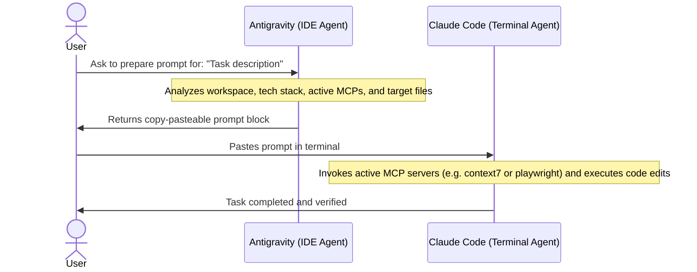

# /antigravity-guide

Use this guide to coordinate tasks between the Antigravity IDE agent and the Claude Code terminal agent.

## Usage

```text
/antigravity-guide
/antigravity-guide prepare: <description of task>
/antigravity-guide status
```

## Operating Rules

1.  **Read-Only Preparation**: Antigravity must perform all initial analysis (file mapping, dependency check, rule extraction) in read-only mode.
2.  **Explicit Context Linking**: All generated prompts must explicitly anchor files using `file:///` URLs.
3.  **Command Translation**: Translate the user's task description into a specific ECC command line (e.g. `/plan`, `/tdd-workflow`).
4.  **No Action Duplication**: Antigravity must never attempt to compile, run tests, or modify source code during the preparation phase.
5.  **MCP Integration**: Direct Claude Code to use its connected MCP servers (`playwright` for browser tests, `context7` for Next.js/Tailwind/Prisma docs, `sequential-thinking` for systemic logic, and `memory` for entity persistence).

## Environment Information

*   **Claude Code version**: `2.1.138 (Native win32-x64)`
*   **Active MCP servers**:
    *   `sequential-thinking` (Connected)
    *   `playwright` (Connected)
    *   `context7` (Connected)
    *   `exa` (Connected)
    *   `github` (Connected)
    *   `memory` (Connected)

## The Cooperative Workflow



### Step 1: Request Prompt Preparation
Ask Antigravity in the IDE chat to prepare a prompt for your task. 
For example:
> "Prepare a prompt for implementing the RFQ fallback button."

### Step 2: Workspace Exploration
Antigravity scans the repository to identify:
*   Relevant source code and test files.
*   The package manager and build/test commands.
*   Active MCP server usage mapping.

### Step 3: Copy and Paste
Antigravity outputs a formatted block. Copy the prompt block and paste it directly into your Claude Code terminal.

### Step 4: Execution and Verification
Claude Code receives the highly detailed prompt and uses its execution capabilities (e.g. running tests, executing tasks, modifying files) to safely carry out the changes.

## Response Patterns

### No Arguments
Provide a quick menu explaining the division of labor, followed by instructions on how to use `prepare: <task>`.

### For `prepare: <task>`
1.  **Analyze**: Look at relevant codebase folders (e.g., `src/`, `components/`, `lib/`).
2.  **Verify target files**: Ensure paths exist.
3.  **Draft prompt**: Output a markdown code block starting with the correct ECC command (e.g. `/tdd-workflow`).
4.  **Confirm**: Remind the user to paste this block into the Claude Code terminal.
5.  **MCP directives**: Include clear guidelines for MCP server invocation (e.g. context7 for Next.js 15 API lookup).