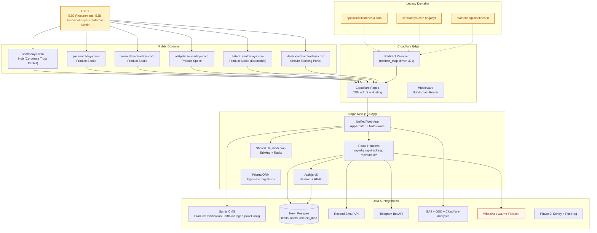
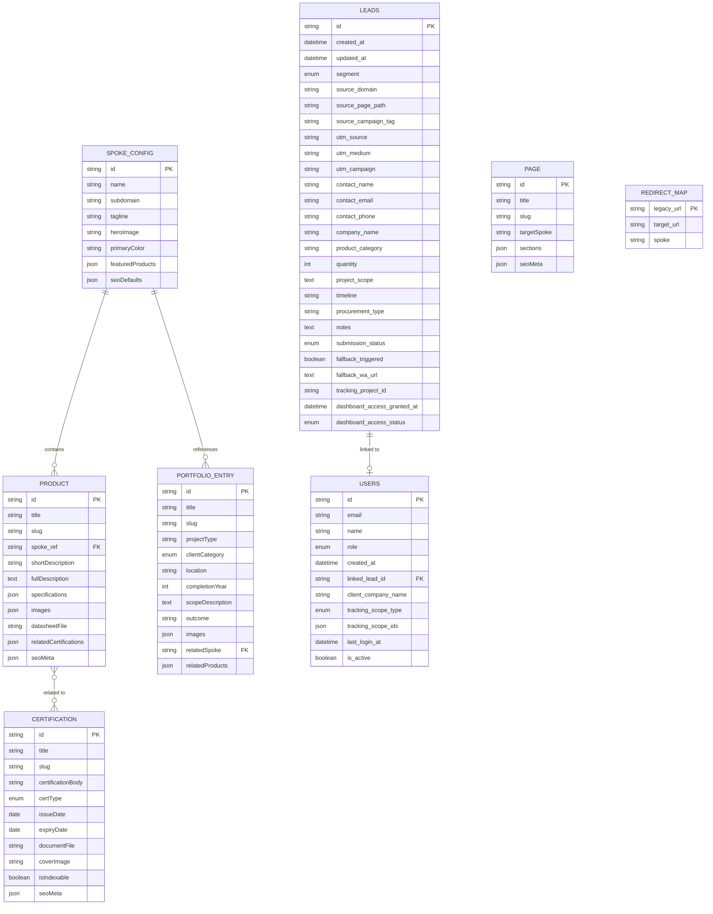
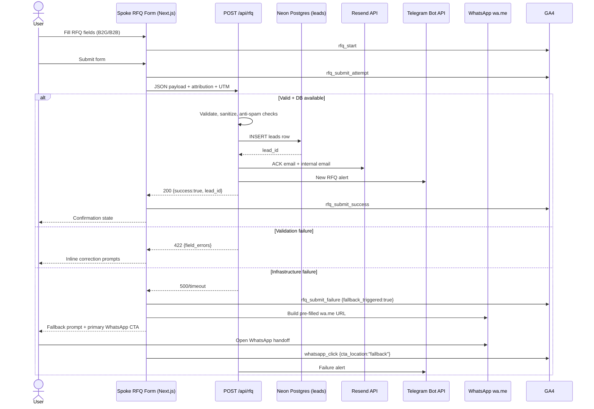
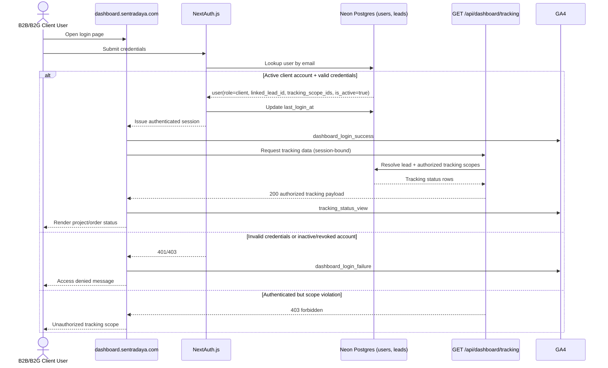

# System Architecture: DBSN Centralized Digital Ecosystem

## 1. Architecture Overview

### Core Tech Stack Summary

- **Application Runtime:** Next.js 16 (App Router, Route Handlers, Server Components, enhanced caching)
- **Repository Strategy:** Single Next.js 16 app with pnpm package manager
- **Content Layer:** Sanity.io (headless CMS, schema-driven content federation)
- **UI System:** Tailwind CSS + Radix UI with shadcn/ui patterns (shared tokenized design system)
- **Transactional Data Layer:** Neon Postgres via Prisma ORM (type-safe migrations)
- **Authentication:** Auth.js v5 (role-based access: `admin`, `viewer`, `client`)
- **Hosting / Edge:** Cloudflare Pages (+ Cloudflare middleware-based subdomain routing, edge redirect handling)
- **Notifications:** Resend (email), Telegram Bot API (internal ops alerting)
- **Telemetry:** GA4 + GSC + Cloudflare Analytics
- **Phase 2 Monitoring:** Sentry (error tracking) + PostHog (session replay)
- **Messaging Fallback:** WhatsApp `wa.me` pre-filled fallback for RFQ failure path

### High-Level System Topology (Hub-and-Spoke)

## 2. Component Breakdown

### Frontend

- **Runtime + Routing:** Next.js 16 App Router with middleware-based subdomain routing; route segmentation by host/subdomain and route groups.
- **Domain Surfaces:**
  - Hub: corporate trust center (`sentradaya.com`)
  - Product spokes: product content + RFQ entry (`pju`, `solarcell`, `alatpetir`, `baterai`)
  - Dashboard spoke: authenticated client tracking (`dashboard.sentradaya.com`)
  - *Testing/Preview Domains:* Hostnames ending with `.vercel.app` (e.g., `dbsn-test01.vercel.app`) are dynamically resolved as root domains by the middleware. This allows full hub-and-spoke testing (e.g., `pju.dbsn-test01.vercel.app`) and preview routing on Vercel before deploying to `sentradaya.com`.
- **UI Architecture:**
  - Single unified app with shadcn/ui patterns (Radix UI primitives)
  - Shared Tailwind token config at repo root (no spoke-local divergence)
  - Shared primitives: navigation, trust badges, certification cards, product spec tables, RFQ form shells, auth forms, tracking status cards
- **Rendering Strategy:**
  - CMS-driven static/ISR where content is stable (hub/spokes content pages)
  - Server-side protected render for dashboard tracking views
- **Mobile-first enforcement:**
  - RFQ and login forms with minimum 44px touch targets
  - Floating WhatsApp CTA collision prevention on form pages

### Backend

- **Edge-facing app backend:** Next.js 16 Route Handlers under `/api/*`.
- **Core service domains:**
  1. RFQ ingestion (validation, persistence, notification, fallback orchestration)
  2. Authentication/session issuance (Auth.js v5)
  3. Admin lead operations (query/filter/update lifecycle)
  4. Client tracking retrieval (authorized status read by `tracking_scope_ids` / `linked_lead_id`)
- **Validation controls:**
  - Server-side input sanitization via Prisma ORM
  - Anti-spam controls (honeypot + rate limiting)
  - Strict 4xx/5xx response semantics
- **Authorization model:**
  - `admin`/`viewer`: internal dashboard access
  - `client`: dashboard tracking access only
  - Ownership guard: client can read only rows bound to their lead/tracking scope

### Infrastructure/DevOps

- **Hosting:** Cloudflare Pages for single Next.js 16 app with middleware-based subdomain routing.
- **Routing model:** Hostname-based middleware routing into single deployment target.
- **Redirect engine:**
  - Data source: Neon Postgres `redirect_map`
  - Resolution order: exact match → pattern match → parent category fallback → spoke home → hub home
  - Hard rule: no unresolved legacy 404 during migration window
- **Database:** Neon Postgres with Prisma ORM, TLS-enforced connections, least-privilege credentials, generous free tier.
- **Operational integrations:** Resend + Telegram for RFQ and failure alerting; optional client access lifecycle alerts.
- **Telemetry pipeline:** event instrumentation to GA4, search visibility via GSC, infra analytics via Cloudflare.
- **Phase 2 monitoring:** Sentry for error tracking + PostHog for session replay and user behavior analytics.

## 3. Data Architecture & Schema

### Entity-Relationship Diagram (CMS + Transactional)

### Detailed Schema Definitions

#### Sanity CMS Schemas

1. **Product**
   - `title: string`
   - `slug: slug`
   - `spoke: reference(SpokeConfig)`
   - `shortDescription: string`
   - `fullDescription: portableText`
   - `specifications: array<{ key: string; value: string }>`
   - `images: array<image>`
   - `datasheetFile: file`
   - `relatedCertifications: array<reference(Certification)>`
   - `seoMeta: { title: string; description: string; ogImage: image }`

2. **Certification**
   - `title: string`
   - `slug: slug`
   - `certificationBody: string`
   - `certType: enum('SNI'|'TKDN'|'LKPP'|'ISO'|'Other')`
   - `issueDate: date`
   - `expiryDate: date`
   - `documentFile: file`
   - `coverImage: image`
   - `isIndexable: boolean`
   - `seoMeta: object`

3. **PortfolioEntry**
   - `title: string`
   - `slug: slug`
   - `projectType: string`
   - `clientCategory: enum('Government'|'BUMN'|'Private'|'EPC')`
   - `location: string`
   - `completionYear: number`
   - `scopeDescription: portableText`
   - `outcome: string`
   - `images: array<image>`
   - `relatedSpoke: reference(SpokeConfig)`
   - `relatedProducts: array<reference(Product)>`

4. **SpokeConfig**
   - `name: string`
   - `subdomain: string`
   - `tagline: string`
   - `heroImage: image`
   - `primaryColor: string (design token)`
   - `featuredProducts: array<reference(Product)>`
   - `seoDefaults: object`

5. **Page**
   - `title: string`
   - `slug: slug`
   - `targetSpoke: reference(SpokeConfig) | null`
   - `sections: array<portableText|customBlock>`
   - `seoMeta: object`

#### Neon Postgres Transactional Schemas (via Prisma ORM)

1. **`leads`** (Prisma model)
   - `id STRING @id @default(cuid()) PRIMARY KEY`
   - `created_at DATETIME @default(now()) NOT NULL`
   - `updated_at DATETIME @updatedAt NOT NULL`
   - `segment SEGMENT('B2G','B2B') NOT NULL`
   - `source_domain STRING(255) NOT NULL`
   - `source_page_path STRING(512) NOT NULL`
   - `source_campaign_tag STRING(255) NULL`
   - `utm_source STRING(255) NULL`
   - `utm_medium STRING(255) NULL`
   - `utm_campaign STRING(255) NULL`
   - `contact_name STRING(255) NOT NULL`
   - `contact_email STRING(255) NOT NULL`
   - `contact_phone STRING(50) NOT NULL`
   - `company_name STRING(255) NOT NULL`
   - `product_category STRING(255) NOT NULL`
   - `quantity Int NULL`
   - `project_scope String NULL`
   - `timeline STRING(255) NULL`
   - `procurement_type STRING(255) NULL` (B2G only)
   - `notes String NULL`
   - `submission_status SUBMISSION_STATUS('received','contacted','qualified','disqualified') @default(RECEIVED) NOT NULL`
   - `fallback_triggered Boolean @default(false) NOT NULL`
   - `fallback_wa_url String NULL`
   - `tracking_project_id STRING(255) NULL`
   - `dashboard_access_granted_at DateTime NULL`
   - `dashboard_access_status DASHBOARD_STATUS('not_eligible','pending','granted','revoked') @default(NOT_ELIGIBLE) NOT NULL`

2. **`users`** (Prisma model)
   - `id STRING @id @default(cuid()) PRIMARY KEY`
   - `email String(255) @unique NOT NULL`
   - `name String(255) NOT NULL`
   - `role ROLE('ADMIN','VIEWER','CLIENT') NOT NULL`
   - `created_at DateTime @default(now()) NOT NULL`
   - `linked_lead_id String @relation(fields: [linked_lead], references: [id]) NULL`
   - `client_company_name String(255) NULL`
   - `tracking_scope_type TRACKING_SCOPE_TYPE('PROJECT','ORDER') NULL`
   - `tracking_scope_ids Json NULL`
   - `last_login_at DateTime NULL`
   - `is_active Boolean @default(true) NOT NULL`

3. **`redirect_map`** (Prisma model)
   - `legacy_url String(1024) PRIMARY KEY`
   - `target_url String(1024) NOT NULL`
   - `spoke String(100) NOT NULL`

## 4. API & Integration Strategy

### Internal API Endpoints

1. `POST /api/rfq`
   - Purpose: ingest segmented RFQ (`B2G`/`B2B`)
   - Input: validated form payload + source attribution + UTM
   - Writes: `leads` via Prisma ORM
   - Side-effects: Resend ACK + internal email, Telegram alert
   - Failure behavior: returns `500|timeout` and provides fallback contract for WhatsApp pre-fill

2. `GET|POST /api/auth/[...nextauth]`
   - Purpose: Auth.js v5 session lifecycle
   - Roles: `ADMIN`, `VIEWER`, `CLIENT`
   - Enforces protected route access and session integrity

3. `GET /api/dashboard/tracking`
   - Auth: required, `role=CLIENT`
   - Input: implied from authenticated user (`linked_lead_id`, `tracking_scope_ids`)
   - Output: authorized project/order tracking statuses only
   - Deny behavior: `401` (unauthenticated), `403` (scope violation), logged event

4. `GET /api/admin/leads`
   - Auth: required, `role in ('ADMIN','VIEWER')`
   - Supports: search/filter by segment/source/submission status
   - ORM: Prisma query with type safety

5. `PATCH /api/admin/leads/:id/status`
   - Auth: required, `role=ADMIN`
   - Updates: `submission_status`, `dashboard_access_status`, `dashboard_access_granted_at`, `tracking_project_id`
   - Optional side-effects: provisioning email + Telegram audit message

### Third-Party Integrations

1. **Resend**
   - Trigger A: successful RFQ submit → customer ACK email
   - Trigger B: successful RFQ submit → internal notification email
   - Trigger C: dashboard access grant → provisioning email with secure login/reset path

2. **Telegram Bot API**
   - Trigger A: RFQ success notification to sales ops channel
   - Trigger B: RFQ failure/fallback trigger alert
   - Trigger C (optional per PRD): client access provisioning/revocation audit alerts

3. **WhatsApp (wa.me fallback)**
   - Trigger: RFQ API/database failure
   - Mechanism: serialized captured RFQ payload into pre-filled URL parameters
   - UX requirement: explicit failure messaging and primary fallback CTA

4. **Phase 2: Sentry + PostHog (Planned)**
   - Sentry: Error tracking, performance monitoring, release tracking
   - PostHog: Session replay, user behavior analytics, product insights
   - Both instruments to be added after Phase 1 stabilization
   - Trigger: RFQ API/database failure
   - Mechanism: serialized captured RFQ payload into pre-filled URL parameters
   - UX requirement: explicit failure messaging and primary fallback CTA

## 5. Key Architectural Flows

### RFQ Submission + Fallback Flow

### Authentication + Tracking Dashboard Flow

## 6. Technical Constraints & Security

1. **Authentication (AuthN):**
   - NextAuth.js mandatory for all protected surfaces.
   - Dashboard routes must reject unauthenticated requests with `401`.

2. **Authorization (AuthZ):**
   - Role model fixed: `admin`, `viewer`, `client`.
   - Client tracking endpoint must enforce ownership checks using `linked_lead_id` + `tracking_scope_ids`.
   - Scope violations must return `403` and be auditable.

3. **Input Security + Anti-Abuse:**
   - RFQ endpoint requires server-side sanitization, honeypot, and rate limiting.
   - No trust in client-submitted role/segment flags without server validation.

4. **Data Security:**
   - TLS-only DB transport.
   - Principle of least privilege for DB credentials and API keys.
   - No PII in GA4 or Cloudflare raw telemetry payloads.

5. **Operational Resilience:**
   - RFQ fallback to WhatsApp is mandatory on API/DB failure.
   - Telegram failure alerts are mandatory in fallback scenarios.

6. **Performance Constraints:**
   - Mobile PSI target: **>= 90** on hub, spoke, RFQ, dashboard login, tracking pages.
   - TTFB target: sub-second via Cloudflare edge.
   - Core Web Vitals must pass acceptable thresholds (LCP, INP/FID, CLS).
   - `next/image` mandatory for image optimization.

7. **Routing/SEO Constraints:**
   - Legacy URL migration must never terminate in unresolved 404 during migration window.
   - Canonical tags required on all authority pages.

## 7. AI Implementation Handoff (Build Order)

1. **Initialize Project Foundations**
   1.1 Configure shared packages (`ui`, `config`, `types`) within single Next.js 16 app.
   1.2 Scaffold Next.js 16 app structure with App Router and host-aware routing utilities.
   1.3 Implement shared Tailwind + Radix baseline tokens at root.

2. **Implement Domain Routing + Edge Topology**
   2.1 Bind hub and spoke hostnames to Cloudflare Pages.
   2.2 Implement hostname resolution middleware/utilities for hub, product spokes, and dashboard spoke.
   2.3 Add legacy redirect resolver integration contract (backed by `redirect_map`).

3. **Build CMS Contracts**
   3.1 Define Sanity schemas: `Product`, `Certification`, `PortfolioEntry`, `SpokeConfig`, `Page`.
   3.2 Implement GROQ query layer for spoke-aware data retrieval.
   3.3 Validate spoke rendering is data-driven with zero code forks.

4. **Provision Transactional Data Layer**
   4.1 Create Neon Postgres schema: `leads`, `users`, `redirect_map` exactly per PRD v3 fields.
   4.2 Add indexes for lead lifecycle filters, source attribution, and linked client lookup.
   4.3 Add migration validation for enum coverage and nullable constraints.

5. **Implement Authentication + Authorization**
   5.1 Integrate NextAuth route handlers.
   5.2 Implement role model (`admin`, `viewer`, `client`) and route guards.
   5.3 Enforce client row-level tracking authorization via `linked_lead_id` + `tracking_scope_ids`.

6. **Implement RFQ Pipeline**
   6.1 Build segmented RFQ API (`/api/rfq`) with strict server-side validation.
   6.2 Persist leads with source attribution + UTM.
   6.3 Implement deterministic success/failure response contracts.

7. **Implement Notification Integrations**
   7.1 Wire Resend for ACK + internal lead email templates.
   7.2 Wire Telegram alerts for RFQ success and fallback failures.
   7.3 Implement dashboard provisioning notification on access grant.

8. **Implement WhatsApp Fallback Engine**
   8.1 Serialize captured RFQ fields to wa.me prefill format.
   8.2 Render explicit fallback UI and elevated primary CTA.
   8.3 Emit fallback telemetry (`rfq_submit_failure`, fallback `whatsapp_click`).

9. **Implement Admin Dashboard**
   9.1 Build protected lead listing with filter/search/source tags.
   9.2 Implement lifecycle updates (`submission_status`, `dashboard_access_status`, `tracking_project_id`).
   9.3 Add export-ready query/model structure.

10. **Implement Client Tracking Dashboard (`dashboard.sentradaya.com`)**
    10.1 Build login + session-protected routes.
    10.2 Build tracking status API bound to authorized scope.
    10.3 Build tracking UI cards/list with mobile-first behavior.

11. **Instrumentation + Telemetry Completion**
    11.1 Implement mandatory GA4 events from PRD (RFQ, WhatsApp, file, hub-spoke, dashboard login, tracking view).
    11.2 Validate no PII leakage in event payloads.
    11.3 Integrate Cloudflare + GSC verification.

12. **Quality Gates and Release Validation**
    12.1 Execute forced RFQ failure test and verify fallback + Telegram alert.
    12.2 Execute dashboard access/data-isolation tests (including forbidden cross-account access).
    12.3 Validate subdomain routing, redirect coverage, CWV/PSI thresholds, and launch gate checklist.
