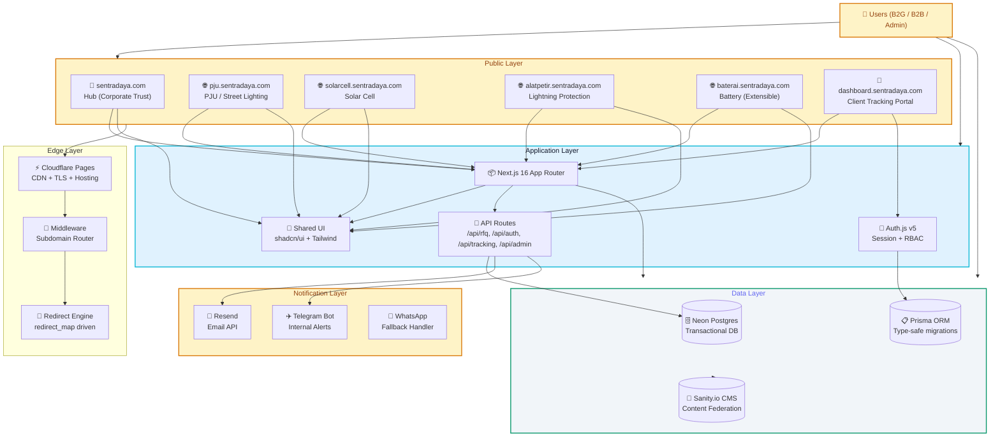
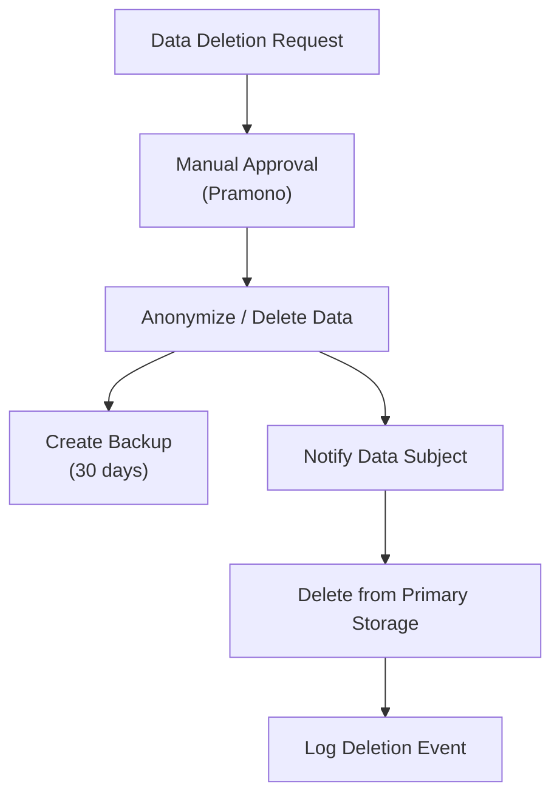

# TDD: Technical Design Document - DBSN Centralized Digital Ecosystem

**Author:** Architect (ECC)
**Date:** 2026-05-19
**Version:** 1.0
**Status:** Ready for Implementation
**Based On:** PRD v3.1

---

## Table of Contents

1. [Context & Purpose](#1-context--purpose)
2. [TDD Philosophy & Approach](#2-tdd-philosophy--approach)
3. [Architecture Design](#3-architecture-design)
4. [Database Design (TDD-First)](#4-database-design-tdd-first)
5. [API Design](#5-api-design)
6. [Notification & Queue System](#6-notification--queue-system)
7. [Compliance & Security](#7-compliance--security)
8. [Performance & Caching](#8-performance--caching)
9. [Testing Strategy](#9-testing-strategy)
10. [Implementation Order](#10-implementation-order)

---

## 1. Context & Purpose

### Problem Statement

DBSN's digital presence is fragmented across three legacy domains, causing trust fragmentation, RFQ drop-off without structured qualification, and post-inquiry visibility gaps for qualified clients.

### This TDD Addresses

This Technical Design Document provides a production-ready blueprint for implementing DBSN Centralized Digital Ecosystem using **Test-Driven Development** methodology. It enforces:

1. **Hub-and-Spoke Architecture:** Single Next.js 16 codebase with middleware-based subdomain routing
2. **Resilient RFQ Pipeline:** Exponential backoff queue with zero-tolerance for lead loss
3. **UU PDP Compliance:** Data retention partitions, encryption standards, manual right-to-erasure workflows
4. **Performance Guarantees:** PSI 90+ mobile score through caching and asset optimization
5. **TDD Discipline:** All production code requires passing tests before merge

---

## 2. TDD Philosophy & Approach

### TDD Cycle

```
┌─────────────────────────────────────────────────────────┐
│                    TEST-DRIVEN DEVELOPMENT                │
├─────────────────────────────────────────────────────────┤
│                                                               │
│  ┌─────────┐    ┌────────────┐    ┌───────────┐ │
│  │   RED    │    │   GREEN    │    │   REFACTOR  │ │
│  │Write Test │    │Write Code  │    │Clean Up   │  │
│  │Fail Test  │    │Pass Test   │    │Pass Test   │  │
│  └─────────┘    └────────────┘    └───────────┘  │
│               ↘           ↙               ↙          │
│          Production-Ready Code                   │
└─────────────────────────────────────────────────────────┘
```

### TDD Rules for DBSN Project

1. **Write Tests First** - No production code without corresponding failing test
2. **Test Isolation** - Each test must be independent and run in any order
3. **Coverage Threshold** - Minimum 80% code coverage before PR approval
4. **Test Categories Required:**
   - Unit tests: Individual functions, utilities, components
   - Integration tests: API endpoints, database operations
   - E2E tests: Critical user flows (RFQ submission, auth, tracking)
5. **No Test Exceptions** - All features, including "urgent" fixes, require tests

---

## 3. Architecture Design

### Hub-and-Spoke Model



### Middleware-Based Subdomain Routing

The core architectural pattern is **middleware-based subdomain routing** that enables a single Next.js 16 codebase to serve multiple domains.

#### Routing Logic

```typescript
// middleware.ts — uses domain helpers from src/lib/middleware/config.ts
import { NextRequest, NextResponse } from 'next/server'
import {
  cleanHostname,
  isHubDomain,
  isDashboardDomain,
  isSpokeDomain,
} from './lib/middleware/config'

export default function middleware(request: NextRequest) {
  const { pathname, search } = request.nextUrl
  const cleanHost = cleanHostname(request.headers.get('host'))
  const spoke = isSpokeDomain(cleanHost)

  // Hub routing
  if (isHubDomain(cleanHost)) {
    const response = NextResponse.next()
    response.headers.set('x-middleware-subdomain', 'hub')
    return response
  }

  // Dashboard routing → rewrite to flat /dashboard/* route
  if (isDashboardDomain(cleanHost)) {
    const url = new URL(`/dashboard${pathname}${search}`, request.url)
    const response = NextResponse.rewrite(url)
    response.headers.set('x-middleware-subdomain', 'dashboard')
    return response
  }

  // Spoke routing
  if (spoke) {
    const url = new URL(`/${spoke}${pathname}${search}`, request.url)
    const response = NextResponse.rewrite(url)
    response.headers.set('x-middleware-subdomain', spoke)
    return response
  }

  return NextResponse.rewrite(new URL('/404', request.url))
}
```

#### Route Groups Structure

```
src/app/
├── (hub)/              # Hub root pages (sentradaya.com)
├── (spokes)/            # Product spoke pages (pju, solarcell, alatpetir, baterai)
│   ├── pju/
│   ├── solarcell/
│   ├── alatpetir/
│   └── baterai/
├── dashboard/           # Client tracking portal (dashboard.sentradaya.com) — flat route, not route group
└── api/                  # API routes (shared across all domains)
```

### Cross-Domain Session Management

Sessions must be scoped correctly to prevent cross-domain leakage:

| Domain | Session Scope | Purpose |
|---------|---------------|---------|
| sentradaya.com | Anonymous | Public browsing |
| Product spokes | Anonymous | Product browsing and RFQ initiation |
| dashboard.sentradaya.com | Authenticated | Secure client access only |

```typescript
// Auth.js configuration for cross-domain sessions
export const authOptions = {
  providers: [...],
  callbacks: {
    async signIn({ user, account, profile }) {
      // Dashboard access requires explicit provisioning
      if (host === 'dashboard.sentradaya.com') {
        const hasAccess = await checkDashboardAccess(user.email);
        if (!hasAccess) {
          throw new Error('Dashboard access not granted');
        }
      }
      return true;
    },
  },
  cookies: {
    // Cookies are scoped to specific domains
    cookieOptions: {
      domain: getCurrentDomain(),
      secure: process.env.NODE_ENV === 'production',
      sameSite: 'strict',
      httpOnly: true,
    },
  },
};
```

---

## 4. Database Design (TDD-First)

### Schema Design Requirements

All database schemas must be designed with testing in mind. This means:

1. **Indexable queries** - All filtering operations must be supported by indexes
2. **Testable relationships** - Foreign keys must be defined and cascade properly
3. **Migration-safe** - Schema changes must be backward-compatible or have explicit migration paths

### Prisma Models (TDD-First Definition)

```prisma
// prisma/schema.prisma

enum Segment {
  B2G
  B2B
}

enum SubmissionStatus {
  RECEIVED
  CONTACTED
  QUALIFIED
  DISQUALIFIED
}

enum DashboardAccessStatus {
  NOT_ELIGIBLE
  PENDING
  GRANTED
  REVOKED
}

enum Role {
  ADMIN
  VIEWER
  CLIENT
}

enum TrackingScopeType {
  PROJECT
  ORDER
}

model Lead {
  id            String   @id @default(cuid())
  createdAt      DateTime  @default(now()) @map("created_at")
  updatedAt      DateTime  @updatedAt @map("updated_at")
  segment        Segment
  
  // Source tracking
  sourceDomain   String   @map("source_domain") @db.VarChar(255)
  sourcePagePath String   @map("source_page_path") @db.VarChar(512)
  sourceCampaignTag  String?  @map("source_campaign_tag") @db.VarChar(255)
  utmSource     String?  @map("utm_source") @db.VarChar(255)
  utmMedium     String?  @map("utm_medium") @db.VarChar(255)
  utmCampaign   String?  @map("utm_campaign") @db.VarChar(255)
  
  // Contact information
  contactName    String?  @map("contact_name") @db.VarChar(255)
  contactEmail   String?  @unique @map("contact_email") @db.VarChar(255)
  contactPhone   String?  @map("contact_phone") @db.VarChar(50)
  companyName   String?  @map("company_name") @db.VarChar(255)
  
  // RFQ details
  productCategory  String?  @map("product_category") @db.VarChar(255)
  quantity        Int?     @map("quantity")
  projectScope    String?  @map("project_scope") @db.Text
  timeline        String?  @map("timeline") @db.VarChar(255)
  procurementType String?  @map("procurement_type") @db.VarChar(255) // B2G only
  notes          String?  @map("notes") @db.Text
  
  // Status tracking
  submissionStatus SubmissionStatus @default(RECEIVED) @map("submission_status")
  fallbackTriggered    Boolean   @default(false) @map("fallback_triggered")
  fallbackWaUrl      String?  @map("fallback_wa_url") @db.Text
  
  // Dashboard provisioning
  trackingProjectId    String?  @map("tracking_project_id") @db.VarChar(255)
  dashboardAccessGrantedAt DateTime?  @map("dashboard_access_granted_at")
  dashboardAccessStatus DashboardAccessStatus @default(NOT_ELIGIBLE) @map("dashboard_access_status")
  
  @@index([segment(ops: desc), createdAt(sort: desc)])
  @@index([sourceDomain])
  @@index([contactEmail])
  @@index([submissionStatus])
}

model User {
  id               String   @id @default(cuid())
  email            String   @unique @map("email") @db.VarChar(255)
  name             String   @map("name") @db.VarChar(255)
  role             Role     @default(ADMIN)
  createdAt         DateTime  @default(now()) @map("created_at")
  
  // Lead linkage (soft delete)
  linkedLeadId     String?  @map("linked_lead_id") @db.VarChar(255)
  clientCompanyName String?  @map("client_company_name") @db.VarChar(255)
  
  // Tracking access scope
  trackingScopeType TrackingScopeType?  @map("tracking_scope_type")
  trackingScopeIds  Json?     @map("tracking_scope_ids") // Array of authorized IDs
  
  lastLoginAt      DateTime?  @map("last_login_at")
  isActive         Boolean   @default(true) @map("is_active")
  
  @@index([email])
  @@index([linkedLeadId])
  @@index([role])
}

model RedirectMap {
  legacyUrl   String   @unique @map("legacy_url") @db.VarChar(1024)
  targetUrl   String   @map("target_url") @db.VarChar(1024)
  spoke      String   @map("spoke") @db.VarChar(100)
  
  @@index([legacyUrl])
}
```

### Database Testing Strategy

```typescript
// Test requirements for database operations

describe('Lead Repository', () => {
  describe('create', () => {
    it('should create lead with source attribution', async () => {
      const lead = await leadRepo.create({
        segment: 'B2G',
        sourceDomain: 'sentradaya.com',
        contactEmail: 'test@example.com',
        // ...
      });
      
      expect(lead.segment).toBe('B2G');
      expect(lead.sourceDomain).toBe('sentradaya.com');
      expect(lead.id).toBeDefined();
      expect(lead.createdAt).toBeDefined();
    });
    
    it('should reject invalid email format', async () => {
      await expect(
        leadRepo.create({ contactEmail: 'invalid-email', segment: 'B2G' })
      ).rejects.toThrow('Invalid email format');
    });
  });
  
  describe('findByTrackingScope', () => {
    it('should only return leads within user scope', async () => {
      const leads = await leadRepo.findByTrackingScope(['lead-1', 'lead-2'], user);
      
      expect(leads).toHaveLength(2);
      expect(leads.every(l => ['lead-1', 'lead-2'].includes(l.id))).toBe(true);
    });
    
    it('should return empty for user with no scope', async () => {
      const leads = await leadRepo.findByTrackingScope([], user);
      expect(leads).toHaveLength(0);
    });
  });
});
```

---

## 5. API Design

### Unified Response Format

All API responses must follow a consistent envelope format for error handling and client-side processing.

```typescript
// API response types

interface ApiSuccessResponse<T> {
  data: T;
  meta?: {
    total?: number;
    page?: number;
    perPage?: number;
    totalPages?: number;
  };
  links?: {
    self?: string;
    next?: string;
    prev?: string;
    first?: string;
    last?: string;
  };
}

interface ApiErrorResponse {
  error: {
    code: string;
    message: string;
    details?: FieldError[];
  };
}

interface FieldError {
  field: string;
  message: string;
  code: string;
}
```

### RFQ API Endpoint

```typescript
// POST /api/rfq
// Tests required before implementation

describe('POST /api/rfq', () => {
  describe('Validation', () => {
    it('should reject B2G without required procurement_type', async () => {
      const response = await fetch('/api/rfq', {
        method: 'POST',
        body: JSON.stringify({
          segment: 'B2G',
          contactEmail: 'test@example.com',
          // Missing procurement_type
        }),
      });
      
      expect(response.status).toBe(422);
      const error = await response.json();
      expect(error.error.code).toBe('validation_error');
      expect(error.error.details).toContainEqual(
        expect.objectContaining({
          field: 'procurement_type',
          code: 'required_field',
        })
      );
    });
    
    it('should reject invalid email format', async () => {
      const response = await fetch('/api/rfq', {
        method: 'POST',
        body: JSON.stringify({
          segment: 'B2G',
          contactEmail: 'invalid-email',
        }),
      });
      
      expect(response.status).toBe(422);
    });
  });
  
  describe('Success Flow', () => {
    it('should create lead and return 201', async () => {
      const validPayload = {
        segment: 'B2G',
        sourceDomain: 'sentradaya.com',
        contactEmail: 'test@example.com',
        contactName: 'Test User',
        companyName: 'PT Test',
        productCategory: 'PJU Solar Cell',
        procurementType: 'Tender Langsung',
      };
      
      const response = await fetch('/api/rfq', {
        method: 'POST',
        body: JSON.stringify(validPayload),
      });
      
      expect(response.status).toBe(201);
      const data = await response.json();
      expect(data.data.id).toBeDefined();
      expect(data.data.submissionStatus).toBe('received');
    });
    
    it('should trigger notifications on success', async () => {
      // Mock notification services
      const resendSpy = jest.spyOn(resendService, 'sendAck');
      const telegramSpy = jest.spyOn(telegramService, 'alertNewRfq');
      
      // Submit RFQ
      await submitRfq(validPayload);
      
      expect(resendSpy).toHaveBeenCalledWith(
        expect.objectContaining({ to: 'test@example.com' })
      );
      expect(telegramSpy).toHaveBeenCalledWith(
        expect.objectContaining({ segment: 'B2G' })
      );
    });
  });
});
```

### Authentication Endpoints

```typescript
// POST /api/auth/client/login

describe('POST /api/auth/client/login', () => {
  it('should authenticate valid client credentials', async () => {
    const response = await fetch('/api/auth/client/login', {
      method: 'POST',
      body: JSON.stringify({
        email: 'client@example.com',
        password: 'correct-password',
      }),
    });
    
    expect(response.status).toBe(200);
    const { data } = await response.json();
    expect(data.user.role).toBe('CLIENT');
    expect(data.user.trackingScopeIds).toBeDefined();
  });
  
  it('should return 401 for invalid credentials', async () => {
    const response = await fetch('/api/auth/client/login', {
      method: 'POST',
      body: JSON.stringify({
        email: 'client@example.com',
        password: 'wrong-password',
      }),
    });
    
    expect(response.status).toBe(401);
  });
  
  it('should return 403 for non-provisioned client', async () => {
    // User exists but no dashboard access
    const response = await fetch('/api/auth/client/login', {
      method: 'POST',
      body: JSON.stringify({
        email: 'unprovisioned@example.com',
        password: 'password',
      }),
    });
    
    expect(response.status).toBe(403);
  });
});
```

---

## 6. Notification & Queue System

### Resilience Requirements

The notification system must guarantee zero lead loss through:

1. **Exponential Backoff** - Retry delays: 1s, 2s, 4s
2. **Maximum Retries** - 3 attempts before fallback
3. **Fallback Alerts** - Telegram notification to admin team
4. **Queue Persistence** - Survive server restart

### Queue Implementation Pattern

```typescript
// Notification queue with TDD tests

interface NotificationJob {
  id: string;
  type: 'email' | 'telegram';
  payload: unknown;
  attempts: number;
  lastAttempt?: Date;
  nextAttempt?: Date;
}

class NotificationQueue {
  private jobs: Map<string, NotificationJob> = new Map();
  
  async enqueue(job: Omit<NotificationJob, 'id'>): Promise<void> {
    const id = generateId();
    const fullJob: NotificationJob = { ...job, id, attempts: 0 };
    this.jobs.set(id, fullJob);
    await this.persistJob(fullJob);
    void this.process(id);
  }
  
  private async process(id: string): Promise<void> {
    const job = this.jobs.get(id);
    if (!job) return;
    
    const delay = Math.pow(2, job.attempts) * 1000; // Exponential backoff
    job.nextAttempt = new Date(Date.now() + delay);
    job.attempts++;
    job.lastAttempt = new Date();
    
    await this.persistJob(job);
    
    setTimeout(async () => {
      try {
        await this.execute(job);
        this.jobs.delete(id);
        await this.removeJob(id);
      } catch (error) {
        if (job.attempts < 3) {
          // Retry with backoff
          await this.process(id);
        } else {
          // Max retries exceeded - alert admin
          await this.alertAdmin(job, error);
          this.jobs.delete(id);
        }
      }
    }, delay);
  }
  
  private async execute(job: NotificationJob): Promise<void> {
    switch (job.type) {
      case 'email':
        await resendService.send(job.payload);
        break;
      case 'telegram':
        await telegramService.send(job.payload);
        break;
    }
  }
  
  private async alertAdmin(job: NotificationJob, error: Error): Promise<void> {
    await telegramService.sendAdminAlert({
      type: 'notification_failure',
      job: job.type,
      payload: job.payload,
      error: error.message,
      timestamp: new Date().toISOString(),
    });
  }
}

// TDD tests
describe('NotificationQueue', () => {
  describe('enqueue', () => {
    it('should queue job and schedule first attempt', async () => {
      const queue = new NotificationQueue();
      const job = { type: 'email', payload: { to: 'test@example.com' } };
      
      await queue.enqueue(job);
      
      const saved = await queue.getJob(job.id);
      expect(saved.attempts).toBe(0);
      expect(saved.nextAttempt).toBeDefined();
    });
  });
  
  describe('retry logic', () => {
    it('should retry with exponential backoff on failure', async () => {
      const queue = new NotificationQueue();
      const failingJob = { type: 'email', payload: { to: 'test@example.com' } };
      
      await queue.enqueue(failingJob);
      // Wait for attempts...
      await waitFor(1500); // First attempt
      
      const job = await queue.getJob(failingJob.id);
      expect(job.attempts).toBe(1);
    });
    
    it('should alert admin after 3 failed attempts', async () => {
      const queue = new NotificationQueue();
      const failingJob = { type: 'email', payload: { to: 'test@example.com' } };
      const alertSpy = jest.spyOn(queue, 'alertAdmin');
      
      await queue.enqueue(failingJob);
      await waitFor(7000); // 3 attempts: 1s + 2s + 4s
      
      expect(alertSpy).toHaveBeenCalled();
    });
  });
});
```

---

## 7. Compliance & Security

### UU PDP Compliance Requirements

**Data Retention Partitions:**

| Data Type | Retention Period | Purpose |
|-----------|----------------|---------|
| Lead data | 3 years | Compliance with UU PDP |
| Transactional data | 30 days | Operational needs |
| Audit logs | 90 days (prod) / 30 days (staging) | Security monitoring |
| User session data | 24 hours (clients) / 8 hours (admin) | Security |

**Right-to-Erasure Workflow:**



### Security Implementation

```typescript
// Encryption-at-rest requirement

import crypto from 'crypto';

class SecureDataHandler {
  private readonly encryptionKey = process.env.ENCRYPTION_KEY;
  
  encrypt(data: string): string {
    const iv = crypto.randomBytes(16);
    const cipher = crypto.createCipheriv('aes-256-cbc', this.encryptionKey, iv);
    let encrypted = cipher.update(data, 'utf8', 'hex');
    encrypted = cipher.final('hex');
    return iv.toString('hex') + ':' + encrypted;
  }
  
  decrypt(encryptedData: string): string {
    const [ivHex, encrypted] = encryptedData.split(':');
    const iv = Buffer.from(ivHex, 'hex');
    const decipher = crypto.createDecipheriv('aes-256-cbc', this.encryptionKey, iv);
    let decrypted = decipher.update(encrypted, 'hex', 'utf8');
    decrypted = decipher.final('utf8');
    return decrypted;
  }
}

// TDD tests
describe('SecureDataHandler', () => {
  it('should encrypt and decrypt data correctly', () => {
    const handler = new SecureDataHandler();
    const original = 'sensitive-data';
    
    const encrypted = handler.encrypt(original);
    const decrypted = handler.decrypt(encrypted);
    
    expect(decrypted).toBe(original);
    expect(encrypted).not.toBe(original);
  });
  
  it('should fail with wrong key', () => {
    const encryptor = new SecureDataHandler();
    const decryptor = new SecureDataHandler({ encryptionKey: 'wrong-key' });
    
    const encrypted = encryptor.encrypt('data');
    
    expect(() => decryptor.decrypt(encrypted)).toThrow();
  });
});
```

---

## 8. Performance & Caching

### PSI 90+ Target Strategy

To guarantee a 90+ PSI mobile score, the following caching and optimization strategies must be implemented:

#### Caching Strategy

```typescript
// Multi-level caching architecture

interface CacheStrategy {
  edge: boolean;      // Cloudflare edge caching
  page: boolean;       // Next.js ISR
  api: boolean;        // Response caching
  image: boolean;      // CDN with proper headers
}

const cacheStrategies: Record<string, CacheStrategy> = {
  // Hub pages - highly cacheable
  '/': { edge: true, page: true, api: false, image: true },
  '/certifications': { edge: true, page: true, api: false, image: true },
  '/portfolio': { edge: true, page: true, api: false, image: true },
  
  // Product pages - moderate cache
  '/(spokes)/pju': { edge: true, page: true, api: false, image: true },
  '/(spokes)/solarcell': { edge: true, page: true, api: false, image: true },
  
  // Dashboard - minimal cache (user-specific)
  '/(dashboard)': { edge: false, page: false, api: true, image: false },
};

// API response caching
export async function cachedFetch(url: string, options: RequestInit) {
  const cacheKey = `api:${url}`;
  const cached = await redis.get(cacheKey);
  
  if (cached) {
    return JSON.parse(cached);
  }
  
  const response = await fetch(url, options);
  const data = await response.json();
  
  // Cache for 5 minutes
  await redis.setex(cacheKey, 300, JSON.stringify(data));
  
  return data;
}
```

#### Image Optimization Strategy

```typescript
// next/image mandatory usage

import Image from 'next/image';

export function ProductImage({ src, alt, priority }: ProductImageProps) {
  return (
    <Image
      src={src}
      alt={alt}
      width={800}
      height={600}
      priority={priority ? true : false}
      loading="lazy"
      placeholder="blur"
      // Output: WebP/AVIF via Next.js config
    />
  );
}

// Hero images - eager load
export function HeroImage({ src, alt }: HeroImageProps) {
  return (
    <Image
      src={src}
      alt={alt}
      width={1920}
      height={1080}
      priority
      loading="eager"
      fetchPriority="high"
    />
  );
}
```

### Performance Testing

```typescript
// Core Web Vitals monitoring

describe('Performance Targets', () => {
  it('should achieve LCP < 2.5s on mobile', async () => {
    const metrics = await runLighthouse('mobile', '/');
    
    expect(metrics.lcp).toBeLessThan(2500);
  });
  
  it('should achieve INP < 200ms on mobile', async () => {
    const metrics = await runLighthouse('mobile', '/');
    
    expect(metrics.inp).toBeLessThan(200);
  });
  
  it('should achieve CLS < 0.1 on all pages', async () => {
    const pages = ['/', '/certifications', '/portfolio', '/(spokes)/pju'];
    
    for (const page of pages) {
      const metrics = await runLighthouse('mobile', page);
      expect(metrics.cls).toBeLessThan(0.1);
    }
  });
});
```

---

## 9. Testing Strategy

### Test Pyramid

```
                    ┌──────────────────┐
                    │   E2E Tests    │
                    │ (Critical Flows) │
                    └──────┬─────────┘
                           │
              ┌────────────────┼────────────────┐
              │                │                │
         ┌────▼────┐    │      ┌────▼─────┐
         │Integration │    │      │Component   │    │      ┌────▼─────┐
         │  Tests     │    │      │  Tests     │    │      │Unit Tests  │
         └────┬─────┘    │      └─────────────┘  │      └─────────────┘
              │            │                │
         └────────────┴────────────────────────┘
```

### Mandatory Test Coverage

| Feature Category | Unit Tests | Integration Tests | E2E Tests | Coverage Target |
|---------------|-------------|------------------|-----------|----------------|
| RFQ System | Validation logic, queue handlers | API endpoints, DB operations | Full submission flow (with fallback) | 90% |
| Authentication | Token validation, session logic | Login/logout endpoints | Login flow across domains | 85% |
| Dashboard Access | Authorization guards, scope checks | Tracking API, dashboard routes | Client login and data isolation | 85% |

### Critical User Flows (E2E Tests)

```typescript
// RFQ Submission Flow - End-to-End

describe('RFQ Submission Flow', () => {
  test('complete success path', async ({ page }) => {
    // Navigate to spoke RFQ form
    await page.goto('https://pju.sentradaya.com/rfq');
    
    // Fill B2G form
    await page.fill('[name="contact_name"]', 'John Doe');
    await page.fill('[name="contact_email"]', 'john@example.com');
    await page.fill('[name="procurement_type"]', 'Tender Langsung');
    
    // Submit
    await page.click('[type="submit"]');
    
    // Verify confirmation
    await expect(page.locator('.confirmation-message')).toBeVisible();
    
    // Verify email sent (mock)
    expect(resendService.sendAck).toHaveBeenCalledWith(
      expect.objectContaining({ to: 'john@example.com' })
    );
    
    // Verify Telegram alert
    expect(telegramService.alertNewRfq).toHaveBeenCalledWith(
      expect.objectContaining({ segment: 'B2G' })
    );
  });
  
  test('fallback path on API failure', async ({ page }) => {
    // Mock API to return 500
    mockApiResponse('/api/rfq', 500);
    
    await page.goto('https://pju.sentradaya.com/rfq');
    await page.fill('[name="contact_email"]', 'john@example.com');
    await page.click('[type="submit"]');
    
    // Verify fallback UI appears
    await expect(page.locator('.fallback-message')).toBeVisible();
    await expect(page.locator('.whatsapp-cta.primary')).toBeVisible();
    
    // Verify pre-filled WhatsApp URL
    const whatsappCta = page.locator('.whatsapp-cta.primary');
    const href = await whatsappCta.getAttribute('href');
    expect(href).toContain('wa.me');
    expect(href).toContain('contact_email=john%40example.com');
  });
});

// Dashboard Access Flow - End-to-End

describe('Dashboard Access Flow', () => {
  test('client can access own tracking data', async ({ page }) => {
    // Login as client
    await page.goto('https://dashboard.sentradaya.com/login');
    await page.fill('[name="email"]', 'client@example.com');
    await page.fill('[name="password"]', 'password');
    await page.click('[type="submit"]');
    
    // Navigate to tracking
    await page.goto('https://dashboard.sentradaya.com/tracking/lead-abc123');
    
    // Verify tracking data is visible
    await expect(page.locator('.tracking-status')).toBeVisible();
    await expect(page.locator('[data-tracking-id="lead-abc123"]')).toBeVisible();
  });
  
  test('client cannot access other client data', async ({ page }) => {
    // Login as Client A with scope: ['lead-abc123']
    await loginAs('client-a@example.com', ['lead-abc123']);
    
    // Try to access Client B's tracking
    await page.goto('https://dashboard.sentradaya.com/tracking/lead-xyz789');
    
    // Verify access denied
    await expect(page.locator('.access-denied')).toBeVisible();
    await expect(page.locator('.error-message')).toContainText('not authorized');
  });
});
```

---

## 10. Implementation Order

### Phase 1: Foundation (Week 1-2)

1. **Project Bootstrap**
   - Initialize Next.js 16 with TypeScript
   - Configure pnpm workspaces
   - Set up shared Tailwind + Radix UI (shadcn/ui)
   - Configure Prisma ORM with Neon Postgres
   - Set up environment variables structure

### Phase 2: Core Features (Week 3-5)

2. **Hub & Spokes**
   - Implement middleware-based subdomain routing
   - Create hub pages (home, certifications, portfolio)
   - Create spoke templates (shared, data-driven)
   - Implement hub-to-spoke navigation

3. **RFQ System**
   - Create segmented RFQ forms (B2G, B2B)
   - Implement server-side validation with Zod
   - Build `/api/rfq` endpoint with retry logic
   - Implement WhatsApp fallback engine
   - Wire Resend + Telegram notifications

4. **Authentication & Dashboard**
   - Configure NextAuth.js v5 with custom providers
   - Implement role-based access control
   - Create dashboard login UI
   - Build admin lead management interface
   - Implement client tracking portal with row-level security

### Phase 3: Infrastructure (Week 6-7)

5. **Integrations**
   - Implement notification queue with Redis/Neon
   - Set up Resend email templates
   - Configure Telegram bot integration
   - Implement Cloudflare Pages deployment
   - Configure 301 redirect engine with redirect_map

6. **SEO & Analytics**
   - Implement SEO migration with redirect mapping
   - Configure GA4 event tracking
   - Set up GSC verification
   - Implement structured data markup

### Phase 4: Quality Gates (Week 8-9)

7. **Performance Optimization**
   - Achieve PSI 90+ on all key pages
   - Implement multi-level caching
   - Optimize images with next/image
   - Configure Core Web Vitals monitoring

8. **Security & Compliance**
   - Implement data encryption at rest
   - Configure data retention policies
   - Set up right-to-erasure workflows
   - Implement security headers (CSP, HSTS)
   - Enable audit logging

9. **Testing & Validation**
   - Implement unit tests for all components
   - Implement integration tests for API endpoints
   - Create E2E tests for critical flows
   - Execute forced failure tests (RFQ fallback)
   - Verify dashboard data isolation
   - Achieve 80%+ code coverage

10. **Deployment & Rollout**
   - Configure staging environment
   - Execute pre-launch QA checklist
   - Plan gradual rollout (feature flags)
   - Configure monitoring and alerting
   - Prepare rollback procedures

### Success Criteria

Each phase must meet these criteria before proceeding:

| Phase | Success Criteria |
|--------|----------------|
| 1. Foundation | Next.js app runs locally, DB connection established, Tailwind configured |
| 2. Core Features | All hub/spoke routes work, RFQ creates leads, auth returns valid tokens |
| 3. Infrastructure | All integrations tested, Cloudflare Pages deployable |
| 4. Quality Gates | PSI 90+ on all templates, 80%+ coverage, security scan passes |
| 5. Deployment | Staging fully functional, rollback plan documented, monitoring active |

---

*End of TDD v1.0*
