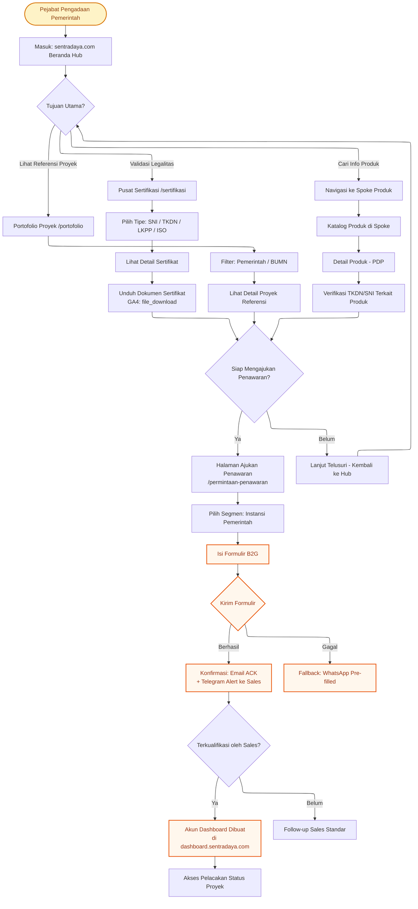
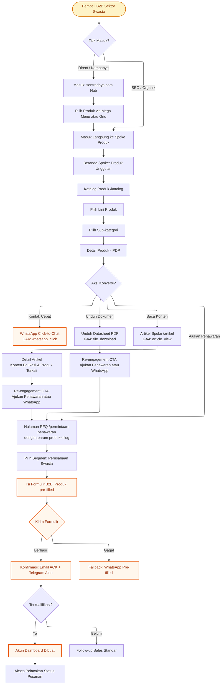
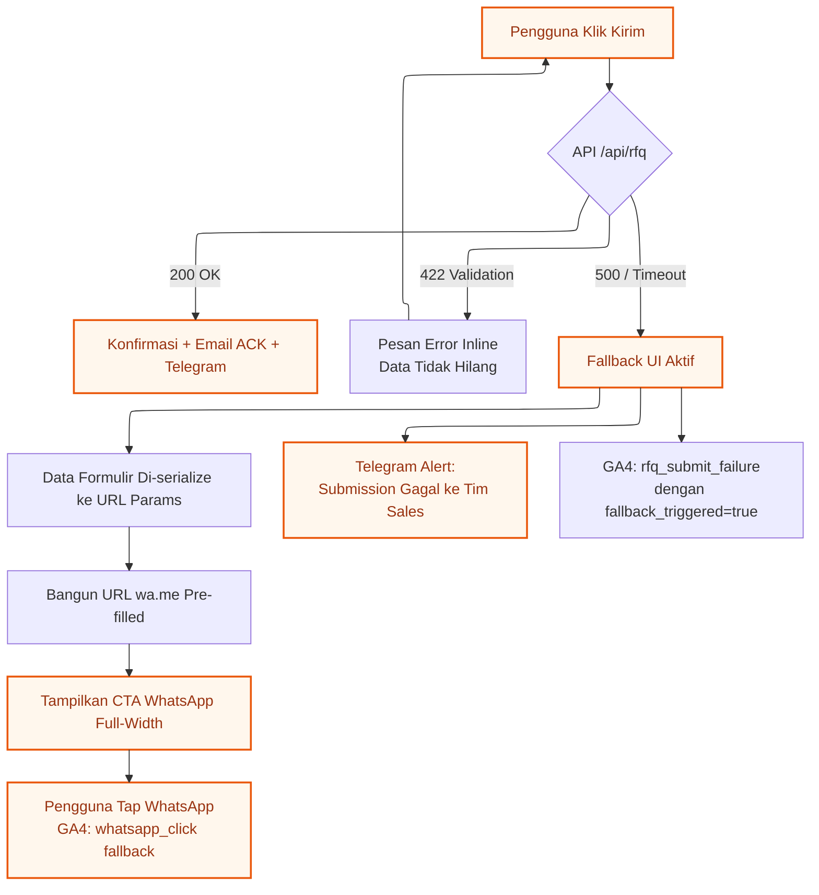

# Arsitektur Informasi — DBSN Digital Ecosystem
## Bagian 3: Alur Pengguna Inti (Core User Flows)

**Proyek:** DBSN Centralized Digital Ecosystem  
**Berbasis:** PRD v3.0 + Jawaban Klarifikasi IA  

---

## 6. Alur Pengguna Inti

### 6.1 Alur B2G — Pejabat Pengadaan Pemerintah

**Persona:** PPK / Staf Pengadaan / Pejabat BUMN  
**Tujuan:** Validasi kepatuhan vendor (SNI/TKDN/LKPP), verifikasi referensi proyek, kemudian ajukan RFQ formal.  
**Entry Point Utama:** Hub (sentradaya.com) via pencarian langsung atau referensi LKPP.

**Langkah-langkah Kunci Alur B2G:** (Single-App dengan middleware routing)

| Langkah | Halaman | Aksi Pengguna | GA4 Event |
|---------|---------|---------------|-----------|
| 1 | Hub Beranda | Lihat Trust Badge Bar, pilih tujuan | - |
| 2a | Pusat Sertifikasi | Telusuri per tipe sertifikasi | `certification_view` |
| 2b | Portofolio | Filter proyek per sektor pemerintah | `portfolio_view` |
| 2c | Spoke PDP | Verifikasi TKDN/SNI di halaman produk | `hub_to_spoke_click` |
| 3 | Detail Sertifikat | Unduh dokumen sertifikat | `file_download` |
| 4 | Ajukan Penawaran | Pilih segmen B2G, isi formulir | `rfq_start` |
| 5 | Formulir B2G | Kirim formulir RFQ | `rfq_submit_attempt` → `rfq_submit_success` |
| 6 | Konfirmasi | Terima email acknowledgment | - |
| 7 | Dashboard | Login dan lihat status proyek | `dashboard_login_success` → `tracking_status_view` |

---

### 6.2 Alur B2B — Pembeli Teknis Sektor Swasta

**Persona:** Procurement Manager / EPC Engineer / Facility Manager  
**Tujuan:** Riset spesifikasi produk, unduh datasheet, kemudian ajukan inquiry terstruktur atau hubungi via WhatsApp.  
**Entry Point Utama:** Spoke langsung via SEO organik, atau Hub via kampanye/direct.

**Langkah-langkah Kunci Alur B2B:**

| Langkah | Halaman | Aksi Pengguna | GA4 Event |
|---------|---------|---------------|-----------|
| 1 | Spoke Beranda atau Hub | Masuk via SEO langsung ke spoke, atau via Hub mega menu | `hub_to_spoke_click` (jika via Hub) |
| 2 | Katalog Produk | Telusuri lini produk dan sub-kategori | - |
| 3 | Detail Produk (PDP) | Baca spesifikasi, lihat gambar | - |
| 4a | PDP | Unduh datasheet | `file_download` |
| 4b | PDP | Klik WhatsApp | `whatsapp_click` |
| 4c | Ajukan Penawaran | Klik CTA, formulir pre-filled | `rfq_start` |
| 4d | Artikel Spoke | Baca konten edukasi produk | `article_view` |
| 5 | Detail Artikel | Baca artikel lengkap, klik CTA re-engagement | `article_cta_click` |
| 6 | Formulir B2B | Kirim formulir | `rfq_submit_attempt` → `rfq_submit_success` |
| 7 | Konfirmasi | Terima email acknowledgment | - |
| 8 | Dashboard | Login dan lihat status pesanan | `dashboard_login_success` → `tracking_status_view` |

---

### 6.3 Perbedaan Kunci Antar Alur

| Aspek | Alur B2G | Alur B2B |
|-------|----------|----------|
| **Entry point** | Selalu via Hub | Sering langsung ke Spoke via SEO |
| **Langkah pertama** | Validasi sertifikasi/legalitas | Riset spesifikasi produk |
| **Jumlah touchpoint sebelum RFQ** | 3-5 (sertifikasi + portofolio + produk) | 2-4 (katalog + PDP + artikel opsional) |
| **Field formulir khusus** | Nama Proyek, Ref DIPA, Jenis Pengadaan | Lingkup proyek, timeline |
| **Toleransi WhatsApp** | Rendah (butuh jalur formal) | Tinggi (channel paralel) |
| **Tipe pelacakan** | Proyek (multi-milestone) | Pesanan (status delivery) |

---

### 6.4 Alur Fallback RFQ (Kedua Segmen)

Berlaku identik untuk B2G dan B2B ketika submission API gagal:

---

## Ringkasan Dokumen IA

| Bagian | Dokumen | Isi |
|--------|---------|-----|
| **1** | [ia-strategy-navigation.md](./ia-strategy-navigation.md) | Strategi IA, prinsip desain, sistem navigasi global |
| **2** | [ia-sitemaps.md](./ia-sitemaps.md) | Sitemap Hub, Spoke template, Dashboard |
| **3** | [ia-user-flows.md](./ia-user-flows.md) | Alur B2G, alur B2B, alur fallback |

---

*Dokumen ini siap digunakan oleh tim UI/UX untuk wireframing dan prototyping.*
