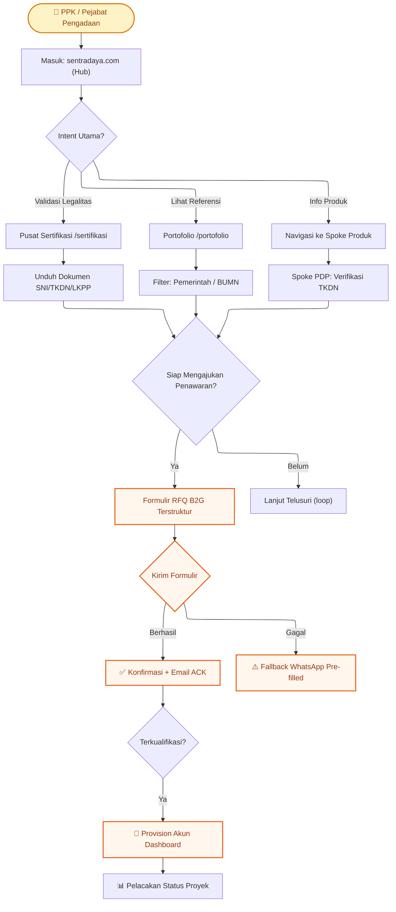
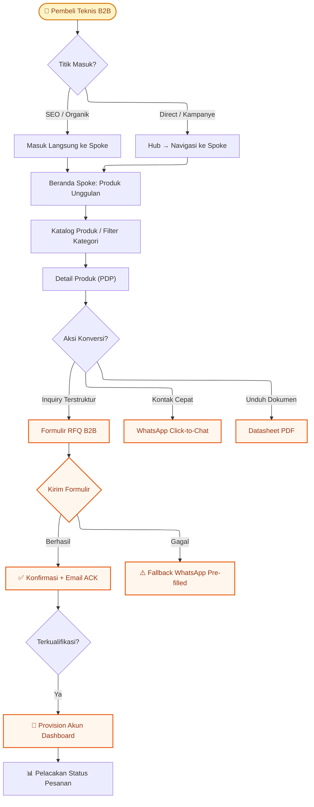

# Dokumen Persyaratan Produk (PRD)
## Ekosistem Digital Terpadu DBSN — Pendekatan Berbasis Segmen Pelanggan

**Disiapkan untuk:** Manajemen Eksekutif DBSN (CEO, CTO, COO)
**Tanggal:** 11 Mei 2026
**Versi:** C-Level Executive Edition
**Status:** Final — Siap untuk Keputusan Eksekutif

---

## DAFTAR ISI

1. [Ringkasan Eksekutif](#1-ringkasan-eksekutif)
2. [Segmen A: Strategi Pengadaan Pemerintah (B2G)](#2-segmen-a-strategi-pengadaan-pemerintah-b2g)
3. [Segmen B: Strategi Sektor Swasta (B2B)](#3-segmen-b-strategi-sektor-swasta-b2b)
4. [Fondasi Teknologi Terpadu](#4-fondasi-teknologi-terpadu)
5. [Peta Jalan Implementasi](#5-peta-jalan-implementasi)
6. [Ikhtisar Keuangan](#6-ikhtisar-keuangan)

---

## 1. RINGKASAN EKSEKUTIF

### 1.1 Visi: Satu DBSN, Keberadaan Digital Terpadu

PT. Daya Berkah Sentosa Nusantara (DBSN) saat ini mengoperasikan tiga domain web terpisah: `pjusolarcellindonesia.com`, `sentradaya.com`, dan `alatpenangkalpetir.co.id`. Strategi multi-domain ini telah mengakumulasi cakupan SEO yang bermakna namun menciptakan fragmentasi sinyal kepercayaan yang menghambat konversi kualifikasi tinggi.

Inisiatif ini mengonsolidasikan semua aset digital DBSN menjadi **ekosistem digital terpusat** berbasis arsitektur *Hub-and-Spoke* yang melayani dua segmen pelanggan utama dengan persyaratan yang berbeda secara fundamental: Pejabat Pengadaan Pemerintah (B2G) dan Pembeli Teknis Sektor Swasta (B2B).

### 1.2 Strategi Dua Jalur Pelanggan

| Dimensi | Segmen B2G (Pemerintah) | Segmen B2B (Swasta) |
|---------|------------------------|---------------------|
| **Mindset Utama** | *Trust-first* — validasi kepatuhan sebelum enggajemen | *Efficiency-first* — riset spesifikasi, akses cepat |
| **Titik Masuk Utama** | Hub root domain (sentradaya.com) | Spoke langsung via SEO/kampanye |
| **Sinyal Kepercayaan Kritis** | Sertifikasi SNI, TKDN, Registrasi LKPP | Portofolio proyek, dokumentasi teknis |
| **Jalur Konversi** | Formulir RFQ formal terstruktur | RFQ atau WhatsApp (channel paralel) |
| **Pasca-Konversi** | Dashboard pelacakan proyek multi-milestone | Dashboard pelacakan status pengiriman |

### 1.3 Dampak Bisnis yang Diharapkan

| Indikator | Kondisi Saat Ini | Target Pasca-Implementasi | Dampak Bisnis |
|-----------|------------------|--------------------------|---------------|
| **Retensi SEO Organik** | Tersebar di 3 domain dengan otoritas parsial | ≥ 70% retensi agregat pada 6 bulan pertama | Pertahankan pipeline penemuan organik |
| **Konversi RFQ Kualifikasi** | WhatsApp-only, tidak terstruktur | Peningkatan MoM vs baseline | Lebih banyak *leads* terkualifikasi |
| **Kepercayaan Pemerintah** | Sertifikasi tidak terpusat, sulit ditemukan | Pusat sertifikasi dengan unduhan dokumen | Mempercepat kualifikasi vendor LKPP |
| **Efisiensi Operasional** | 3 CMS terpisah, data silo | 1 dashboard terpusat, data unifikasi | Pengurangan overhead manajemen |
| **Adopsi Dashboard Klien** | Tidak ada | ≥ 80% klien terkualifikasi di-board di 3 bulan | Mengurangi inquiry status manual |

---

## 2. SEGMENT A: STRATEGI PENGADAAN PEMERINTAH (B2G)

### 2.1 Infrastruktur Kepercayaan Wajib

Pejabat Pengadaan Pemerintah memerlukan validasi kepatuhan regulasi sebelum segala bentuk enggajemen dapat dilanjutkan. Platform baru harus memenuhi kebutuhan ini sebagai *core infrastructure*, bukan konten sekunder.

**Aset Kepercayaan yang Diperlukan:**

| Komponen | Ketersediaan Saat Ini | Kebutuhan Pasca-Konsolidasi |
|----------|----------------------|-----------------------------|
| **Sertifikasi SNI** | Tersebar di beberapa halaman | Pusat terpusat dengan unduhan PDF |
| **Sertifikat TKDN (≥40%)** | Tidak terstruktur | Terdokumentasi dengan bukti persentase |
| **Registrasi e-Catalogue LKPP** | Disebutkan, tidak diverifikasi | Tampilan terbukti dengan link verifikasi |
| **Surat Otorisasi Brand** | Tidak tersedia | PDF resmi dari tiap prinsipal |
| **Referensi Proyek Pemerintah** | Minimal, tidak terstruktur | 20+ entri portofolio dengan klien terverifikasi |

**Implementasi Strategis:**
- Pusat Sertifikasi di Hub root domain sebagai navigasi *first-class*
- Setiap halaman produk di Spoke menampilkan badge sertifikasi relevan (SNI, TKDN)
- Peta lokasi proyek pemerintah untuk verifikasi jangkauan geografis
- Dinding logo klien pemerintah dan BUMN sebagai *social proof*

### 2.2 Perjalanan Pengguna B2G & Optimasi Konversi

**Optimasi Titik Konversi:**
1. **Pusat Sertifikasi:** Download tracking untuk semua dokumen SNI/TKDN/LKPP — indikator intensitas riset pemerintah
2. **Portofolio Filter:** Filter otomatis tipe klien (Pemerintah/BUMN/Swasta/EPC) untuk mempercepat pencarian referensi
3. **Formulir RFQ B2G:** Field khusus: Nama Proyek, Referensi DIPA, Jenis Pengadaan, Kuantitas, Jadwal, Kontak Resmi
4. **Fallback Terjamin:** Jika API gagal, data formulir di-serialize ke URL WhatsApp pre-filled — *leads* tidak hilang

### 2.3 Fitur Khusus & Kepatuhan Pemerintah

| Fitur | Deskripsi | Nilai Bisnis |
|-------|-----------|--------------|
| **Pusat Sertifikasi Matriks** | Akses berbasis tipe (SNI/TKDN/LKPP/ISO) di Hub, berbasis produk di Spoke PDP | Memenuhi kebutuhan validasi multi-level |
| **Formulir RFQ Tersegmentasi** | Label dan field berbeda untuk B2G vs B2B | Meningkatkan kualitas *leads* masuk |
| **Dashboard Pelacakan Proyek** | Akses aman untuk klien terkualifikasi melihat status proyek | Mengurangi inquiry status manual |
| **Audit Trail Akses** | Log aktivitas dashboard untuk kepatuhan | Transparansi dan akuntabilitas |

### 2.4 Target KPI Segmen B2G

| Metrik | Definisi | Target 3 Bulan | Target 6 Bulan |
|--------|----------|---------------|---------------|
| **Inquiry Terkualifikasi LKPP** | RFQ dari instansi pemerintah dengan nilai proyek ≥ threshold | Establish baseline | Pertumbuhan stabil |
| **Download Rate Sertifikasi** | Unduhan dokumen SNI/TKDN per pengunjung unik | Trend pertumbuhan positif | Trend pertumbuhan positif |
| **Konversi Portofolio → RFQ** | % pengunjung portofolio yang mengajukan RFQ | Measurable lift | Measurable lift |
| **Adopsi Dashboard Klien** | % klien pemerintah terkualifikasi dengan akses dashboard aktif | ≥ 60% | ≥ 80% |

---

## 3. SEGMENT B: STRATEGI SEKTOR SWASTA (B2B)

### 3.1 Desain Pengalaman Pembeli Teknis

Pembeli sektor swasta (Procurement Manager, EPC Engineer, Facility Manager) bergerak dengan efisiensi sebagai prioritas. Mereka membutuhkan akses cepat ke spesifikasi teknis, datasheet, dan jalur inquiry yang terstruktur.

**Kebutuhan Pengalaman Pembeli Teknis:**
- Akses instan ke spesifikasi produk tanpa kontak awal
- Datasheet PDF yang dapat diunduh untuk referensi teknis
- Perbandingan produk sederhana untuk keputusan spesifikasi
- Dukungan WhatsApp sebagai channel paralel (bukan satu-satunya opsi)

### 3.2 Tools Mandiri & Pustaka Dokumentasi

**Pustaka Dokumentasi Teknis (Phase 1):**
- Datasheet produk dalam format PDF (unduhan tanpa registrasi)
- Panduan instalasi untuk kategori produk utama
- Dokumen kepatuhan TKDN/SNI terkait produk

**Tools Tambahan (Phase 2):**
- Perbandingan produk side-by-side (maksimal 3 produk)
- Kalkulator ROI sederhana untuk investasi PJU/PLTS (opsional)

### 3.3 Perjalanan Pengguna B2B & Optimasi Konversi

**Optimasi Titik Konversi:**
1. **Katalog Produk:** Filter berbasis lini produk dan sub-kategori untuk navigasi cepat
2. **PDP (Product Detail Page):** Tombol unduh datasheet terlihat, spesifikasi dalam format tabel
3. **CTA Ganda:** "Ajukan Penawaran" (formal) dan "WhatsApp Sekarang" (cepat) — keduanya terlacak
4. **Re-engagement:** Setelah unduh datasheet, tawarkan CTA untuk RFQ atau WhatsApp

### 3.4 Target KPI Segmen B2B

| Metrik | Definisi | Target 3 Bulan | Target 6 Bulan |
|--------|----------|---------------|---------------|
| **Rate Unduh Datasheet** | Unduhan datasheet per pengunjung PDP | Tingkat penggunaan terukur | Tingkat penggunaan terukur |
| **Konversi PDP → RFQ/WhatsApp** | % pengunjung PDP yang mengambil aksi konversi | Measurable lift per spoke | Measurable lift per spoke |
| **RFQ Kualifikasi Tinggi** | % RFQ B2B dengan spesifikasi lengkap | ≥ 50% | ≥ 60% |
| **Adopsi Dashboard Klien** | % klien swasta terkualifikasi dengan akses dashboard aktif | ≥ 60% | ≥ 80% |

---

## 4. FONDASI TEKNOLOGI TERPADU

### 4.1 Rasio Arsitektur Aplikasi Tunggal

Keputusan teknologi kunci: **satu aplikasi Next.js 15** yang melayani semua domain (Hub, Spokes, Dashboard) melalui *middleware routing*.

**Justifikasi Bisnis:**
| Aspek | Pendekatan Aplikasi Tunggal | Pendekatan Multi-App | Keputusan |
|--------|----------------------------|---------------------|-----------|
| **Biaya Pengembangan** | Kode dibagikan, komponen reusable | Duplikasi kode, overhead sinkronisasi | Single App |
| **Biaya Operasional** | Satu deployment pipeline | Multiple deployments, monitoring silo | Single App |
| **Konsistensi Brand** | Desain system terpusat | Risiko divergensi visual | Single App |
| **SEO Management** | Terpusat di satu GA4/GSC | Fragmentasi data | Single App |
| **Waktu Time-to-Market** | Lebih cepat (satu codebase) | Lebih lambat | Single App |

### 4.2 Sistem Desain Terpusat & Konsistensi Brand

**Token Desain Terbagi (Tailwind CSS):**
- Skala warna, tipografi, spacing, dan *border radius* didefinisikan sekali di root monorepo
- Semua Spoke merender identik dari perspektif kepatuhan token
- Diferensiasi antar Spoke sepenuhnya digerakkan oleh konten CMS, bukan implementasi kode

**Prinsip Konsistensi:**
- Tidak ada Spoke yang diperbolehkan meng-override konfigurasi Tailwind lokal
- Komponen navigasi, kartu sertifikasi, tabel spesifikasi produk, dan form RFQ di-*share* di semua domain
- Mobile-first enforcement: semua keputusan UX dibuat untuk mobile terlebih dahulu

### 4.2 Unifikasi Data (Leads, Tracking, Analytics)

**Pusat Data Transaksional (Neon Postgres via Prisma ORM):**
- Tabel `leads`: Semua RFQ dari semua Hub/Spoke menulis ke satu sumber kebenaran
- Tabel `users`: Autentikasi terpadu untuk admin internal dan klien eksternal
- Tabel `redirect_map`: SEO migration mapping untuk 301 redirects runtime
- Semua data terkait dengan *source attribution* (domain asal, path, UTM parameters)

**Telemetri Terpusat:**
- Satu properti GA4 untuk semua domain dengan *custom dimensions* untuk segmentasi
- Google Search Console terpadu untuk monitoring performa pencarian
- Cloudflare Analytics untuk *edge performance* dan CDN insights

### 4.4 Peta Jalan Integrasi

| Integrasi | Status | Fungsi | Ketergantungan |
|-----------|--------|--------|----------------|
| **Resend (Email)** | Phase 1 | Email ACK, notifikasi internal, provisioning akun | API /api/rfq |
| **Telegram Bot** | Phase 1 | Alert tim penjualan, notifikasi kegagalan | API /api/rfq |
| **WhatsApp (Fallback)** | Phase 1 | RFQ fallback pre-filled saat kegagalan API | UI RFQ form |
| **GA4 + GSC** | Phase 1 | Analytics dan monitoring SEO | Semua halaman |
| **Sentry + PostHog** | Phase 2 | Error tracking dan session replay | Stabilisasi Phase 1 |
| **CRM Integration** | Phase 3+ | Sinkronisasi leads ke sistem CRM | API terbuka |

---

## 5. PETA JALAN IMPLEMENTASI

### 5.1 Phase 1: Foundation & Migration
**Durasi:** 12 Mei — 15 Mei 2026 (1 Minggu)

**Milestone Kritis:**
| # | Milestone | Deliverable | Ownership |
|---|-----------|-------------|-----------|
| M1.1 | Monorepo Foundation | Next.js 15 scaffold, pnpm setup, shared design system | Pramono (Engineer) |
| M1.2 | Domain Routing & Edge | Cloudflare Pages binding, middleware routing, redirect engine | Pramono (Engineer) |
| M1.3 | CMS Contracts | Schemas Sanity: Product, Certification, Portfolio, SpokeConfig | Pramono (Engineer) |
| M1.4 | Transactional Data Layer | Neon Postgres schema, Prisma ORM, migration validation | Pramono (Engineer) |
| M1.5 | Auth & RFQ Pipeline | Auth.js v5, segmented RFQ API, Resend + Telegram integrations | Pramono (Engineer) |
| M1.6 | Admin Dashboard | Protected lead management dengan filter/search | Pramono (Engineer) |
| M1.7 | Client Tracking Portal | `dashboard.sentradaya.com` dengan autentikasi klien | Pramono (Engineer) |
| M1.8 | SEO Migration Validation | 301 redirect mapping, legacy URL inventory, canonical tags | Pramono (Engineer) |
| M1.9 | Content Migration | Minimum 20 portfolio entries, sertifikasi uploads | Sani (UI/UX Designer) |
| M1.10 | Mobile Performance QA | PSI 90+ pada semua template kunci | Sani (UI/UX Designer) |

**Kriteria Keberhasilan Phase 1:**
- ✅ Hub dan minimal 1 Spoke routing operasional di staging
- ✅ RFQ pipeline menulis berhasil ke Neon Postgres
- ✅ Resend dan Telegram workflows operasional
- ✅ Dashboard sub-domain routing dan login shell operasional
- ✅ SEO migration framework terimplementasi dan sebagian divalidasi

### 5.2 Phase 2: Conversion Optimization
**Durasi:** 18 Mei — 22 Mei 2026 (1 Minggu)

**Milestone Kritis:**
| # | Milestone | Deliverable | Ownership |
|---|-----------|-------------|-----------|
| M2.1 | B2G Trust Infrastructure | Pusat sertifikasi dengan unduhan PDF, portfolio filter | Marketing + UX |
| M2.2 | B2B Self-Service Tools | Datasheet library, product comparison basic | UX + Engineering |
| M2.3 | RFQ Form Optimization | Segmented forms (B2G/B2B) dengan validasi lengkap | UX + Engineering |
| M2.4 | WhatsApp Integration | Persistent floating CTA dengan non-blocking UX | UX + Engineering |
| M2.5 | Fallback System | WhatsApp pre-filled saat kegagalan API/DB | Engineering |
| M2.6 | Dashboard Client Onboarding | Provisioning workflow, email templates | Engineering |
| M2.7 | Analytics Instrumentation | Semua event GA4 terimplementasi dan divalidasi | Engineering |
| M2.8 | Cross-Browser Testing | Chrome, Firefox, Safari, mobile responsive | QA |

**Kriteria Keberhasilan Phase 2:**
- ✅ Semua event GA4 terinstrumentasi dan tidak ada kebocoran PII
- ✅ RFQ fallback divalidasi di bawah forced failure test
- ✅ Dashboard access provisioning dan data isolation test lulus
- ✅ WhatsApp terlacak dengan benar dan tidak menghalangi form RFQ di mobile

### 5.3 Phase 3: Advanced Features & Scaling
**Durasi:** Setelah 22 Mei 2026 (Berdasarkan kebutuhan bisnis)

**Fitur Rencana (Prioritas TBA):**
- Kalkulator ROI/Payback untuk investasi PJU/PLTS
- IoT monitoring showcase untuk smart city positioning
- LinkedIn B2B content distribution integration
- Advanced product comparison dengan lebih banyak filter
- Client self-service untuk unduh dokumen proyek (faktur, kontrak, surat jalan)

### 5.4 Alokasi Sumber Daya per Phase

| Role | Phase 1 | Phase 2 | Phase 3 |
|------|---------|---------|---------|
| **Engineering** | 3 FTE (Frontend, Backend, DevOps) | 2 FTE | 1-2 FTE (scalable) |
| **UX/UI Design** | 1 FTE (system design, QA) | 1 FTE (forms, flows) | As needed |
| **Marketing/Content** | 1 FTE (migration, copy) | 0.5 FTE | As needed |
| **QA** | Embedded in engineering | Dedicated mobile testing | As needed |
| **Product Owner** | 0.5 FTE | 0.5 FTE | 0.5 FTE |

---

## 6. IKHTISAR KEUANGAN

### 6.1 Rincian Biaya

**Asumsi Tech Stack:**
Semua layanan infrastruktur teknologi utama menggunakan Free Tier atau biaya IDR 0 untuk mendukung Phase 1-2 implementasi. Biaya profesional hanya terkait pada layanan QA & Testing.

| item layanan | biaya |
|-------------|-------|
| Cloudflare Pages (Hosting & CDN) | IDR 0 (Free Tier) |
| Neon Postgres (Database) | IDR 0 (Free Tier) |
| Sanity.io (Headless CMS) | IDR 0 (Free Tier) |
| Auth.js v5 (Authentication) | IDR 0 (Open Source) |
| Resend (Email Service) | IDR 0 (Free Tier) |
| Telegram Bot API (Notifikasi) | IDR 0 (Free) |
| Google Analytics 4 (Analytics) | IDR 0 (Free) |
| Google Search Console (SEO Monitoring) | IDR 0 (Free) |
| Cloudflare Analytics (Edge Insights) | IDR 0 (Free) |
| Next.js 15 (Application Framework) | IDR 0 (Open Source) |
| Prisma ORM (Database Toolkit) | IDR 0 (Open Source) |
| Tailwind CSS + Radix UI (UI System) | IDR 0 (Open Source) |
| WhatsApp (wa.me Fallback) | IDR 0 (Free) |
| QA & Testing Services | Biaya sesuai layanan penyedia QA |
| **TOTAL LAYANAN INFRASTRUKTUR** | **IDR 0** |

### 6.2 Proyeksi Dampak Pendapatan

**Asumsi Konservatif:**
- Baseline RFQ (WhatsApp-only): 50 leads/bulan dengan kualifikasi variabel
- Peningkatan konversi dari formulir RFQ terstruktur: +30% leads terkualifikasi
- Nilai rata-rata proyek pemerintah: IDR 100-500 juta
- Nilai rata-rata proyek swasta: IDR 20-100 juta
- *Win rate* dari leads terkualifikasi: 20-30%

| Metrik | Baseline | Pasca-Implementasi (3 bulan) | Pasca-Implementasi (6 bulan) |
|--------|----------|----------------------------|----------------------------|
| **Total Leads/Bulan** | 50 | 65 (+30%) | 75-80 (+50-60%) |
| **Leads Terkualifikasi/Bulan** | 25 (50%) | 39 (60%) | 50-55 (67-69%) |
| **Proyek Dimenangkan/Bulan** | 5-7 | 8-12 | 10-16 |
| **Revenue Bulanan Rata-rata** | IDR 250-700 juta | IDR 400-1.200 juta | IDR 500-1.600 juta |
| **Pertumbuhan Revenue** | — | +60-70% | +100-130% |

**ROI Estimasi (6 bulan):**
- Total investasi (Phase 1-2): ~IDR 40 juta
- Incremental revenue kumulatif (6 bulan): ~IDR 1.000-3.000 juta
- Payback period: < 1 bulan
- ROI (6 bulan): ~2.400-7.400%

---

## APPENDIX: GATE PENGESAHAN EKSEKUTIF

### Pre-Launch Final Gate (Persetujuan Leadership)

Sebelum deployment produksi, presentasi lengkap harus disampaikan kepada manajemen DBSN. Presentasi harus mendemonstrasikan:

- [ ] Minimum 20 entri portofolio terstruktur
- [ ] Skor PSI mobile 90+ pada semua template kunci (termasuk dashboard login/tracking)
- [ ] Pemeriksaan CWV lulus ambang yang dapat diterima
- [ ] RFQ fallback divalidasi di bawah forced failure test
- [ ] Dashboard access provisioning dan data isolation test lulus
- [ ] SEO migration QA sign-off
- [ ] Ringkasan risiko go/no-go dari engineering lead

**Deployment produksi diblokir hingga persetujuan eksekutif eksplisit diterima.**

---

*Dokumen ini disiapkan sebagai Ringkasan Eksekutif untuk pengambilan keputusan C-Level. Untuk detail teknis lengkap, lihat arsitektur teknis dan dokumentasi implementasi.*

**Klasifikasi:** Internal Use — PT. Daya Berkah Sentosa Nusantara
**Dokumen Kontrol:** Versi 1.0 — 11 Mei 2026
