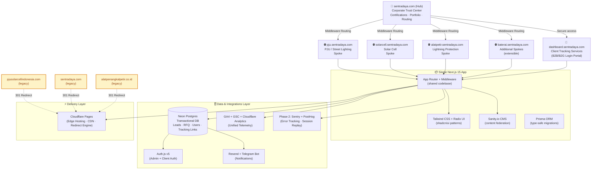
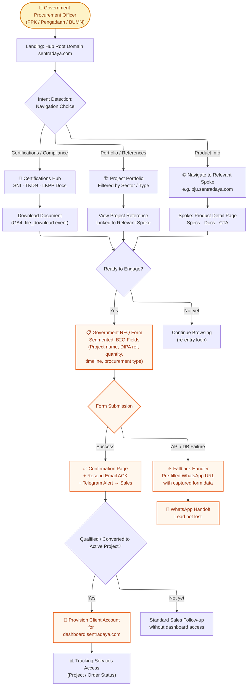
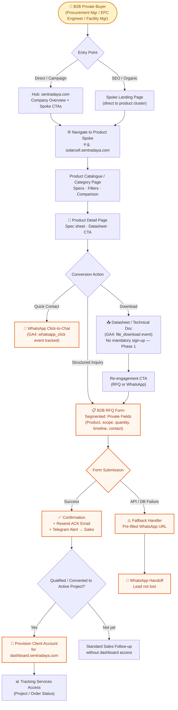
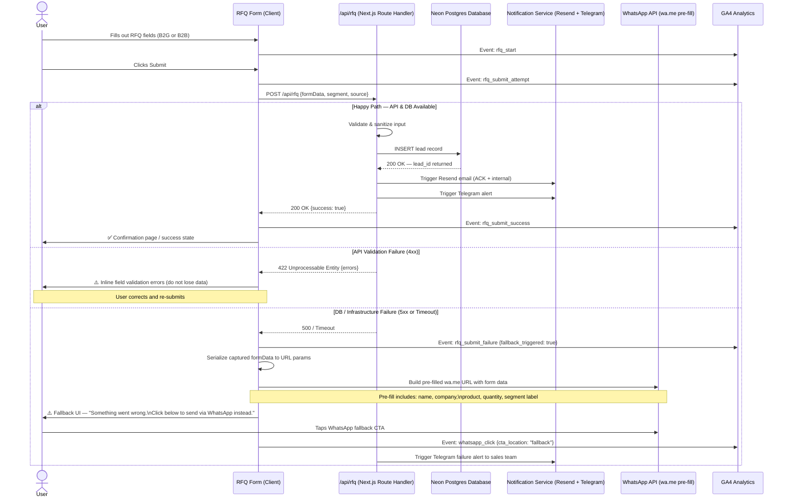

# PRD: DBSN Centralized Digital Ecosystem

**Author:** Pramono
**Date:** 2026-04-21
**Status:** Draft (Discovery Complete)
**Version:** 3.0
**Taskmaster Optimized:** Yes

---

## Table of Contents

1. [Problem Statement & System Context](#1-problem-statement--system-context)
   - 1.1 [Background / Latar Belakang Masalah](#11-background--latar-belakang-masalah)
   - 1.2 [Target Audience](#12-target-audience)
   - 1.3 [High-Level Architecture](#13-high-level-architecture)
   - 1.4 [Success Metrics & KPIs](#14-success-metrics--kpis)
2. [User Journeys & UI/UX Requirements](#2-user-journeys--uiux-requirements)
   - 2.1 [Core User Flows](#21-core-user-flows)
   - 2.2 [Shared Design System](#22-shared-design-system)
   - 2.3 [Mobile-First & Accessibility](#23-mobile-first--accessibility)
3. [Functional & Non-Functional Requirements](#3-functional--non-functional-requirements)
   - 3.1 [Functional Requirements](#31-functional-requirements)
   - 3.2 [Performance Targets & Core Web Vitals](#32-performance-targets--core-web-vitals)
   - 3.3 [Security & Access](#33-security--access)
4. [Data Models & Event Tracking](#4-data-models--event-tracking-telemetry)
   - 4.1 [CMS Schema](#41-cms-schema)
   - 4.2 [Transactional Database](#42-transactional-database)
   - 4.3 [Analytics & Telemetry Strategy](#43-analytics--telemetry-strategy)
5. [Integrations, Routing, & Fallbacks](#5-integrations-routing--fallbacks)
   - 5.1 [SEO Migration Engine](#51-seo-migration-engine)
   - 5.2 [Notification Pipeline](#52-notification-pipeline)
   - 5.3 [Graceful Fallback System](#53-graceful-fallback-system)
6. [Validation & Release Checkpoints](#6-validation--release-checkpoints)
   - 6.1 [Design & UX QA](#61-design--ux-qa)
   - 6.2 [Tech & Load Testing](#62-tech--load-testing)
   - 6.3 [Approval Gates](#63-approval-gates)

---

## 1. Problem Statement & System Context

### 1.1 Background / Latar Belakang Masalah

DBSN's digital presence is currently fragmented across three independently operated legacy domains: `pjusolarcellindonesia.com`, `sentradaya.com`, and `alatpenangkalpetir.co.id`. While this multi-domain strategy accumulated meaningful keyword-level SEO coverage, it has created a set of compounding structural problems that now impede qualified conversion.

**Trust Fragmentation.** Government and B2B buyers encountering inconsistent brand footprints across three separate domains cannot form a unified vendor confidence signal. For procurement-critical contexts (B2G, EPC, BUMN), this fragmentation directly undermines vendor shortlisting.

**RFQ Drop-Off.** The dominant conversion path is WhatsApp-only. There is no structured, segmented RFQ form with field-level capture for product category, project scope, procurement timeline, or buyer segment. This limits DBSN's ability to qualify inbound intent and creates invisible drop-off with no recovery mechanism.

**Post-RFQ Visibility Gap.** After successful inquiry submission, clients currently have no secure self-service surface to monitor project or order progression. This creates repeated manual status inquiries, increases operational load on sales/admin teams, and weakens the trust signal for enterprise procurement journeys that expect transparent status tracking.

**Operational Overhead.** Content, lead management, and analytics are siloed per domain. There is no unified dashboard, no cross-domain source attribution, and no single operational surface for the sales team to work from.

**Why Solve This Now.** DBSN has outgrown the multi-site model. SEO migration risk increases non-linearly if not addressed as a structured initiative. Competition in B2B digital channels for renewable and electrical infrastructure is intensifying, and an internal strategic directive has explicitly prioritized trust signal architecture and conversion infrastructure as the next growth unlock.

---

### 1.2 Target Audience

DBSN's digital platform serves two distinct buyer segments, each with materially different intent signals, compliance requirements, and conversion path expectations.

**Segment A — B2G: Government Procurement Officers**

This segment includes PPK (Pejabat Pembuat Komitmen), Pengadaan staff, and BUMN procurement officers. These users are process-bound: they must validate that DBSN meets regulatory compliance requirements (SNI, TKDN, LKPP registration) before any engagement can proceed. Their primary journey is a trust-verification loop: they arrive looking for credentials, certifications, and structured references. The RFQ they submit is a formal inquiry, not a casual interest signal. Friction in this path — whether due to unavailable documents, non-structured contact flows, or form failures — directly causes disqualification at the vendor shortlisting stage. Once qualified and active, these users also expect visibility into procurement and delivery progress through a controlled tracking portal.

**Segment B — B2B: Private Sector Technical Buyers**

This segment includes procurement managers at private enterprises, EPC (Engineering, Procurement & Construction) project engineers, and facility managers. These users are efficiency-driven: they want to compare technical specifications, access datasheets, and initiate a scoped inquiry as quickly as possible. They are more tolerant of WhatsApp as a parallel channel but respond positively to structured self-service. Friction in this path is experienced as unnecessary form complexity or missing technical documentation — resulting in quiet abandonment. After RFQ qualification, these users require a secure login to track project/order status without relying solely on manual follow-up.

---

### 1.3 High-Level Architecture

The locked architectural model is a **Hub-and-Spoke Sub-domain Architecture** delivered from a **single Next.js 15 application** with middleware-based subdomain routing. The hub operates on the root domain and functions as the corporate trust center: it hosts the company profile, certifications, cross-sector portfolio, and routing CTAs that direct users to the appropriate product spoke. Each product spoke is a dedicated sub-domain (e.g., `pju.sentradaya.com`, `solarcell.sentradaya.com`, `alatpetir.sentradaya.com`, `baterai.sentradaya.com`) hosting product-cluster content, product pages, and the segmented RFQ entry point.

In Version 3.0, the architecture is extended with a dedicated secure access spoke: **`dashboard.sentradaya.com`**. This sub-domain functions as the client login and tracking services portal (Layanan Pelacakan) for B2B and B2G clients who have successfully progressed through RFQ and qualification workflows. The dashboard is not a public marketing surface; it is an authenticated operational surface linked to client-specific tracking/project identifiers.

All subdomains (hub, spokes, dashboard) are served from a **single unified Next.js codebase** with a shared design system (Tailwind CSS + Radix UI via shadcn/ui patterns) and a unified data pipeline (Sanity CMS + Neon Postgres via Prisma ORM). There are no divergent code forks between subdomains — all differentiation is handled by middleware routing and data-driven content via Sanity schemas and role/access controls.

**Locked Stack:** Next.js 15 (App Router) · pnpm · Sanity.io · Tailwind CSS + Radix UI · Neon Postgres + Prisma ORM · Auth.js v5 · Cloudflare Pages · Resend + Telegram Bot · GA4 + GSC + Cloudflare Analytics · Phase 2: Sentry + PostHog

---

### 1.4 Success Metrics & KPIs

| # | Goal | Primary Metric | Target | Timeframe | Measurement Method |
|---|------|----------------|--------|-----------|-------------------|
| G1 | Preserve & Consolidate SEO Equity | Post-migration organic traffic retention | ≥ 70% of combined pre-migration baseline | Months 1–6 post-launch | GA4 + GSC + Cloudflare Analytics |
| G2 | Increase Qualified Conversion | Qualified RFQ submissions / month | MoM uplift vs. WhatsApp-only baseline | First 3 months post-launch | Centralized dashboard with source attribution |
| G3 | Improve Procurement Trust Engagement | Certification & datasheet download rate | Continuous growth trend | Months 1–3 post-launch | GA4 file events + CMS analytics |
| G4 | Improve Conversion Efficiency by Entry Context | Product page → RFQ/WhatsApp conversion rate | Measurable lift per spoke | First 90 days | GA4 funnel events + CRM tagging |
| G5 | Lead Operations Unification | Lead centralization completeness | 100% of leads captured with source tags | At launch | Dashboard audit |
| G6 | Capture Government Procurement Fit | LKPP-qualified inquiry rate | Establish & grow stable qualified baseline | Months 1–3 post-launch | RFQ form qualifiers + sales validation |
| G7 | Mobile-First Performance Excellence | PageSpeed Insights mobile score | 90+ on key templates | At launch & maintained | PSI + Lighthouse CI |
| G8 | Optimize Hub-to-Spoke Journey | Hub-to-Spoke CTR & journey completion | Strong routing efficiency per segment path | Months 1–2 post-launch | GA4 pathing + event instrumentation |
| G9 | Establish Client Tracking Adoption | Qualified clients with active dashboard access and first tracking view | ≥ 80% of eligible clients onboarded | First 3 months post-launch | Dashboard auth logs + GA4 tracking events |

---

## 2. User Journeys & UI/UX Requirements

### 2.1 Core User Flows

Two primary user journeys govern the conversion architecture: the **B2G Government Procurement Validation Flow** and the **B2B Private Technical Buyer Flow**. Both journeys must be designed to minimize friction at the qualification and submission stage while enabling a controlled transition to post-submission tracking access for eligible clients.

#### B2G — Government Procurement Validation Flow

The government buyer arrives with a compliance-first mindset. They must verify legal and regulatory credentials before any contact is initiated. The platform must meet them at this intent: surfacing certifications, portfolio references, and a government-labeled RFQ form without requiring them to navigate away from a structured, trustworthy context.

#### B2B — Private Technical Buyer Flow

The private sector buyer arrives with a product-research or spec-validation intent. They move through spoke product pages, consume technical documentation, and expect a fast path to inquiry initiation. WhatsApp remains available throughout as a parallel channel but should not be the only structured option.

---

### 2.2 Shared Design System

All spokes must render identically from the perspective of design token compliance. Differentiation between spokes is strictly content-driven — never the result of divergent component implementations or style overrides.

The design system is built on **Tailwind CSS** (utility-first styling with a shared token configuration) and **Radix UI** (accessible, headless component primitives). Component configurations — spacing scale, typography scale, color tokens, border radii, breakpoints — are defined once in the monorepo root and consumed by all apps. No spoke may introduce a local `tailwind.config.js` that deviates from the root configuration.

Key shared component categories include: navigation headers, trust-badge blocks, certification card components, product spec tables, RFQ form shells (variant: B2G / B2B), floating CTA wrappers, portfolio grid components, document download cards, secure authentication forms, and tracking status cards for dashboard views.

---

### 2.3 Mobile-First & Accessibility

DBSN's target audience operates in Indonesia's mobile-dominant usage context. All UX decisions must be made mobile-first, with desktop treated as a progressive enhancement.

**Floating CTA Rule (Critical).** The persistent WhatsApp floating CTA must never obscure RFQ form fields or the form's primary submit action on mobile viewports. On screens where the form is active, the CTA must either collapse, reposition, or render in a non-overlapping fixed zone. This is a hard launch gate requirement validated in QA.

**Mobile Form UX.** RFQ forms must be thumb-navigable: sufficient tap-target sizing (minimum 44px), no horizontally scrolling form containers, native mobile input types (`tel`, `email`, `date`) where applicable, and clear inline validation messaging. Dashboard login forms must follow the same touch and readability standards.

**Performance as Accessibility.** A PSI score of 90+ on key mobile templates is a proxy for accessibility in bandwidth-constrained environments. Large image assets must use `next/image` with proper lazy loading. No unoptimized media may ship to production.

---

## 3. Functional & Non-Functional Requirements

### 3.1 Functional Requirements

#### Must Have (P0) — Critical for Launch

**REQ-001 — Main Hub Trust Platform.** Implement the root-domain hub including company profile, legal credibility content, certifications access, cross-sector portfolio navigation, and routing CTAs to all active spokes. Acceptance: Hub links all active spokes with consistent UX; certifications section supports downloadable files; portfolio section is first-class navigation.

**REQ-002 — Product Spoke Sub-domains.** Each product cluster must operate on a dedicated sub-domain (`pju.`, `solar.`, `lightning.`, etc.) with shared codebase templates and distinct data-driven product content. Acceptance: Sub-domain routing is operational; shared design system applied identically across spokes; content differences are Sanity-driven, not code forks.

**REQ-003 — Certifications Hub.** Centralized document trust center for SNI, TKDN, LKPP, and supporting legal artifacts. Acceptance: Structured metadata per document; download access functional on mobile and desktop; document pages indexable where appropriate.

**REQ-004 — Structured RFQ System (Segmented).** Segmented RFQ forms for Government (B2G) and Private (B2B) pathways with structured fields and server-side validation. Acceptance: Government and private variants are distinct in copy and field schema; captures product category, specs, quantity, timeline, and contact; malformed submissions blocked by validation; submissions persist reliably in Neon Postgres.

**REQ-005 — Persistent WhatsApp Integration (Non-Blocking UX).** Site-wide persistent click-to-chat CTA that does not obstruct RFQ form interactions on mobile. Acceptance: Floating CTA available site-wide; obstruction-safe behavior on RFQ screens; all WhatsApp click events tracked to GA4.

**REQ-006 — Project Portfolio (First-Class Feature).** Portfolio must be a core navigation feature with structured entries, sector filtering, and contextual spoke linking. Acceptance: Minimum 20 structured entries before Phase 1 launch approval; entries include project type, client category, location, scope, and outcome.

**REQ-007 — Centralized Lead & RFQ Data Pipeline.** All inbound RFQs and leads from all hub/spoke entry points must write to a single Neon Postgres transactional database with source attribution. Acceptance: Schema supports full lead lifecycle fields and source tags; all submission endpoints write with retry/error handling; dashboard reflects near-real-time updates.

**REQ-008 — SEO Migration & Redirect System.** Preserve accumulated SEO equity via complete 301 migration mapping from legacy domains to the new architecture. Acceptance: URL mapping table covers all indexed/high-value pages; legacy URLs without direct mapping 301 to nearest parent category — never an unresolved 404 during the migration window; canonical rules implemented on all new pages.

**REQ-009 — Notification Workflow.** New RFQs and leads trigger operational notifications. Acceptance: Transactional email via Resend for RFQ acknowledgment and internal notice; Telegram alert for near-real-time internal follow-up.

**REQ-010 — Authenticated Admin Dashboard.** Centralized dashboard for lead/RFQ management using Auth.js v5. Acceptance: Secure login and protected routes; lead list with filter, search, and source tag columns; segment-based views (Government vs. Private); export-ready data structure.

**REQ-011 — Authenticated Client Tracking Portal (`dashboard.sentradaya.com`).** Implement secure B2B/B2G client login for Tracking Services (Layanan Pelacakan), linked to approved RFQ/project records. Acceptance: dedicated sub-domain routing active; only provisioned client accounts can authenticate; authenticated clients can view only their associated project/order tracking statuses; unauthorized access attempts are denied and logged.

#### Should Have (P1)

**REQ-012 — Documentation Library Expansion.** Richer technical library including datasheets, installation guides, and compliance references with indexing and category filtering beyond the Phase 1 certifications hub scope.

**REQ-013 — Product Comparison Tool.** Basic side-by-side comparison functionality for selected product categories within a spoke.

#### Nice to Have (P2)

**REQ-014 — ROI Calculator & IoT Showcase.** Advanced pre-sales tooling (ROI/payback calculator) and smart-city capability presentation surface. Deferred to Phase 2/3.

---

### 3.2 Performance Targets & Core Web Vitals

The performance floor for the DBSN platform is defined by PSI (PageSpeed Insights) mobile scores and Core Web Vitals thresholds. These are not aspirational targets — they are launch gate requirements.

**PageSpeed Insights.** All key page templates (hub home, spoke landing, product detail, RFQ page, client dashboard login, and tracking status overview) must achieve a mobile PSI score of **90 or above**. Benchmarks will be captured at the start of Sprint 1 against current legacy pages to establish a baseline.

**TTFB (Time to First Byte).** Edge delivery via Cloudflare Pages must support sub-second TTFB on all server-rendered and static routes. ISR (Incremental Static Regeneration) must be configured appropriately for CMS-driven content.

**Core Web Vitals.** All key templates must pass CWV acceptable thresholds: LCP (Largest Contentful Paint), FID/INP (Interaction to Next Paint), and CLS (Cumulative Layout Shift). Zero tolerance for unresolved layout shifts from late-loading assets, fonts, or dynamic CTA components.

**Asset Discipline.** All images must be served via `next/image` with WebP/AVIF output and lazy loading. Document/PDF assets must be served from Sanity CDN without triggering layout shifts. Hero sections and above-the-fold areas must not contain unoptimized media.

---

### 3.3 Security & Access

**Admin Authentication.** The internal dashboard and all protected API routes must be gated by Auth.js v5 with a least-privilege role model. Unauthenticated requests to protected endpoints must return 401/403 — never silently fail or expose lead data.

**Client Portal Authentication.** `dashboard.sentradaya.com` must use secure authenticated access for provisioned B2B/B2G clients only. Client users must be explicitly linked to lead/project tracking records. Access scope must enforce row-level ownership constraints so clients can only retrieve their own tracking data. Session handling, password policy/reset flow, and login attempt throttling are mandatory.

**Input Validation & Anti-Spam.** All RFQ submission endpoints must implement server-side input sanitization and anti-spam measures (e.g., honeypot fields, rate limiting). Legacy WordPress content ingested into Sanity must be sanitized to remove malformed HTML, shortcodes, and script injections before being published via Next.js rendering.

**Data Handling.** All lead, RFQ, user, and tracking-link records must be stored under TLS-enforced connections. Neon Postgres access credentials must follow the principle of least privilege. No lead/client PII is logged in Cloudflare Analytics or GA4 raw event payloads.

---

## 4. Data Models & Event Tracking (Telemetry)

### 4.1 CMS Schema

All content for hub and spokes is managed in **Sanity.io** as the single source of truth. The following document types are required at launch.

**Product** — Fields: `title`, `slug`, `spoke` (reference to spoke config), `shortDescription`, `fullDescription` (portable text), `specifications` (array of key-value pairs), `images` (array), `datasheetFile` (file asset), `relatedCertifications` (array of references), `seoMeta` (title, description, OG image).

**Certification** — Fields: `title`, `slug`, `certificationBody`, `certType` (enum: SNI | TKDN | LKPP | ISO | Other), `issueDate`, `expiryDate`, `documentFile` (file asset), `coverImage`, `isIndexable` (boolean), `seoMeta`.

**PortfolioEntry** — Fields: `title`, `slug`, `projectType`, `clientCategory` (enum: Government | BUMN | Private | EPC), `location`, `completionYear`, `scopeDescription` (portable text), `outcome`, `images` (array), `relatedSpoke` (reference), `relatedProducts` (array of references).

**SpokeConfig** — Fields: `name`, `subdomain`, `tagline`, `heroImage`, `primaryColor` (token), `featuredProducts` (array of references), `seoDefaults`.

**Page** (generic) — Fields: `title`, `slug`, `targetSpoke` (null = hub), `sections` (array of portable text / content blocks), `seoMeta`.

---

### 4.2 Transactional Database

All transactional lead and user data is stored in **Neon Postgres**. The following table structure (via Prisma ORM) is required at launch.

**`leads` table** — `id` (CUID), `created_at`, `updated_at`, `segment` (enum: B2G | B2B), `source_domain`, `source_page_path`, `source_campaign_tag`, `utm_source`, `utm_medium`, `utm_campaign`, `contact_name`, `contact_email`, `contact_phone`, `company_name`, `product_category`, `quantity`, `project_scope`, `timeline`, `procurement_type` (B2G only), `notes`, `submission_status` (enum: received | contacted | qualified | disqualified), `fallback_triggered` (boolean — was WhatsApp fallback activated?), `fallback_wa_url` (if triggered), `tracking_project_id` (nullable, assigned when lead progresses to tracked project/order), `dashboard_access_granted_at` (nullable datetime), `dashboard_access_status` (enum: not_eligible | pending | granted | revoked).

**`users` table** — `id`, `email`, `name`, `role` (enum: admin | viewer | client), `created_at`, `linked_lead_id` (nullable FK to `leads.id`), `client_company_name` (nullable), `tracking_scope_type` (nullable enum: project | order), `tracking_scope_ids` (nullable JSON array of authorized tracking/project IDs), `last_login_at` (nullable datetime), `is_active` (boolean default true) — used for internal dashboard authentication and authenticated client tracking access via Auth.js v5.

**`redirect_map` table** — `legacy_url`, `target_url`, `spoke` — used by the edge redirect engine to resolve 301 mappings at runtime without code deploys.

---

### 4.3 Analytics & Telemetry Strategy

All GA4 events must be instrumented at launch. These are mandatory — not optional enhancements.

| Event Name | Trigger | Key Parameters |
|---|---|---|
| `whatsapp_click` | User taps/clicks any WhatsApp CTA | `source_page`, `spoke`, `cta_location` (floating \| inline \| fallback) |
| `rfq_start` | User focuses first field in RFQ form | `form_type` (B2G \| B2B), `spoke`, `source_page` |
| `rfq_submit_attempt` | User clicks submit on RFQ form | `form_type`, `spoke`, `field_count_filled` |
| `rfq_submit_success` | RFQ API returns 200 | `form_type`, `spoke`, `source_domain` |
| `rfq_submit_failure` | RFQ API returns non-200 or network error | `error_code`, `fallback_triggered` (true) |
| `rfq_abandonment` | User exits page after `rfq_start` without `rfq_submit_success` | `last_field_focused`, `form_type`, `spoke` |
| `file_download` | User downloads certification, datasheet, or document | `file_name`, `file_type`, `cert_type`, `spoke` |
| `hub_to_spoke_click` | User clicks a spoke navigation CTA from the hub | `spoke_target`, `cta_label`, `hub_section` |
| `portfolio_view` | User views a portfolio entry detail page | `project_type`, `client_category`, `related_spoke` |
| `certification_view` | User opens a certification detail page | `cert_type`, `cert_title` |
| `dashboard_login_success` | Authorized client successfully logs into `dashboard.sentradaya.com` | `user_role`, `segment`, `linked_lead_id` |
| `dashboard_login_failure` | Client login attempt fails | `failure_reason`, `attempt_source` |
| `tracking_status_view` | Authenticated client opens project/order tracking screen | `tracking_scope_type`, `tracking_id`, `segment` |

---

## 5. Integrations, Routing, & Fallbacks

### 5.1 SEO Migration Engine

The SEO migration is one of the highest-risk elements of this project. The rule is absolute: **no legacy indexed URL may resolve to a 404 during the migration window, under any condition.**

**URL Mapping Strategy.** A complete URL inventory must be produced for all three legacy domains before Sprint 1 ends, covering all pages indexed in Google Search Console, all pages with inbound backlinks, and all high-traffic organic landing pages from GA4. Each URL must be mapped to its target in the new architecture (hub page, spoke page, product page, or portfolio entry).

**Redirect Execution.** 301 redirects are executed at the Cloudflare edge layer using the `redirect_map` table stored in Neon Postgres. This allows redirect rules to be updated without code deploys. Cloudflare Workers handle URL resolution: exact match first, then pattern match, then parent-category fallback.

**Fallback Hierarchy.** For legacy URLs that cannot be mapped to a specific page, the fallback chain is: (1) nearest parent category on the relevant spoke; (2) the spoke homepage; (3) the hub homepage. An unresolved 404 is never the terminal state during the migration window.

**Canonical Implementation.** All new pages must implement `<link rel="canonical">` pointing to their authoritative URL. Cross-domain canonicals must be reviewed and cleared before launch.

---

### 5.2 Notification Pipeline

New RFQ submissions and lead captures must trigger two parallel notification channels in near-real-time.

**Resend (Email).** Two email sends are triggered per successful RFQ submission: (1) a transactional acknowledgment email to the submitter confirming receipt and setting response-time expectations; (2) an internal notification email to the designated DBSN sales inbox with the full lead details and a link to the dashboard record. Resend templates must be maintained in version control. No raw API keys may be stored client-side.

When a lead is approved for Tracking Services, an additional provisioning email is sent to the designated client contact containing dashboard onboarding instructions and a secure login/reset path for `dashboard.sentradaya.com`.

**Telegram Bot.** An internal Telegram bot sends an alert to the DBSN sales operations channel for every new RFQ submission. The alert payload includes: segment (B2G/B2B), spoke, company name, product category, and a direct dashboard link. The Telegram bot is also configured to alert on submission failures — if the RFQ API returns an error, the sales team is notified that a WhatsApp fallback was triggered. Optional secondary alerting is enabled for client-access provisioning and revocation actions for audit visibility.

---

### 5.3 Graceful Fallback System

The RFQ submission path must be resilient to API and database failures. No lead may be silently lost due to a technical failure. The graceful fallback system ensures that when the primary submission pipeline fails, the user is transparently transitioned to a pre-filled WhatsApp URL that carries the form data they have already entered.

**Fallback UX Requirements.** The fallback state must be clearly communicated to the user — it should not appear as a silent failure. The fallback CTA copy must convey that their information will be carried over: e.g., *"Something went wrong on our end. Tap below to send your request via WhatsApp — your details are pre-filled."* The floating WhatsApp CTA in the fallback state must be elevated to a primary, full-width button, not the standard floating icon.

---

## 6. Validation & Release Checkpoints

### 6.1 Design & UX QA

Design QA must be completed before any checkpoint sign-off. The following consistency checks must pass across all hub and spoke templates.

All pages must render correctly on three viewport breakpoints: 375px (mobile S), 768px (tablet), and 1280px (desktop). The shared design system token set — spacing, typography, color, border radius — must be identical across hub and spokes, confirmed via visual regression. No spoke may introduce a locally overridden Tailwind config. The floating WhatsApp CTA must be validated on mobile viewports across all page types to confirm it does not occlude RFQ form fields or the submit button. All RFQ form variants (B2G and B2B) must render without horizontal scroll on 375px viewport. Dashboard login and tracking-status templates must pass the same mobile legibility and touch-target checks.

### 6.2 Tech & Load Testing

**RFQ Fallback Simulation.** A forced-failure test must be executed in the staging environment by deliberately making the Neon Postgres connection unavailable and submitting an RFQ. The expected outcome is: (1) GA4 `rfq_submit_failure` event fires with `fallback_triggered: true`; (2) fallback UI renders with correct pre-filled WhatsApp URL; (3) Telegram failure alert is received by the ops channel. This test is a hard launch gate.

**Sub-domain Routing Verification.** All configured spoke sub-domains, including `dashboard.sentradaya.com`, must be verified to route correctly from Cloudflare to the correct Next.js app router segment. Cross-spoke navigation links from the hub must be tested for correctness in both staging and production DNS environments.

**Dashboard Access & Data Isolation Test.** Validate client onboarding and login lifecycle end-to-end: account provisioning from qualified lead, first login flow, and tracking-status retrieval. Attempt cross-account access to confirm row-level isolation blocks unauthorized project/order visibility. Failed login attempt throttling and audit logging must be verified.

**301 Redirect Coverage Audit.** The complete legacy URL inventory must be run through the redirect engine in staging. Zero unresolved 404s are acceptable. Spot-check coverage must include the top 20 organic pages per legacy domain as identified in GSC.

**Load & Spike Testing.** Simulate realistic campaign spike traffic against the RFQ submission endpoint and hub homepage. Confirm Cloudflare edge caching behavior and Neon Postgres connection pool behavior under concurrent load. Execute additional concurrent-session tests on dashboard login and tracking endpoints to validate stable authenticated performance.

### 6.3 Approval Gates

**End of Sprint 1 Gate.** The following must be demonstrable before Sprint 2 begins: hub and at least one spoke routing operational in staging; 301 mapping framework implemented and partially validated; RFQ pipeline writes successfully to Neon Postgres; certifications hub MVP live in staging.

**Mid Sprint 2 Gate.** Admin dashboard authentication and lead listing are functional; Resend and Telegram notification workflows are operational; WhatsApp integration is tracked via GA4; dashboard sub-domain routing and login shell are operational in staging.

**Pre-Launch Final Gate (Leadership Approval).** A full sprint presentation must be delivered to DBSN leadership before any production deployment. The presentation must demonstrate: minimum 20 portfolio entries; PSI mobile score 90+ on all key templates (including dashboard login/tracking templates); CWV checks passing acceptable thresholds; RFQ fallback validated under forced failure test; dashboard access provisioning and data isolation test pass; SEO migration QA sign-off; and a go/no-go risk summary from the engineering lead. Production deployment is blocked until explicit leadership approval is received.

---

*End of PRD — Version 3.0*

*This document reflects all finalized discovery outputs including locked architecture, technical stack, 1-month compressed timeline, integration priorities, secure tracking-portal expansion, and explicit migration, performance, and fallback risk controls.*